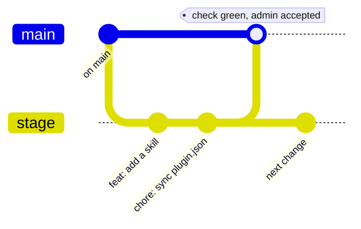
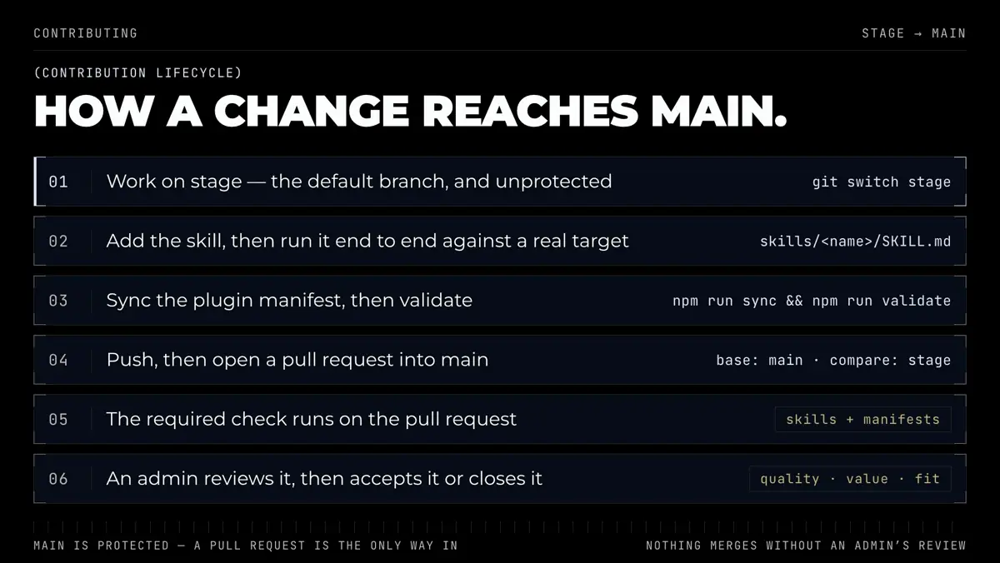
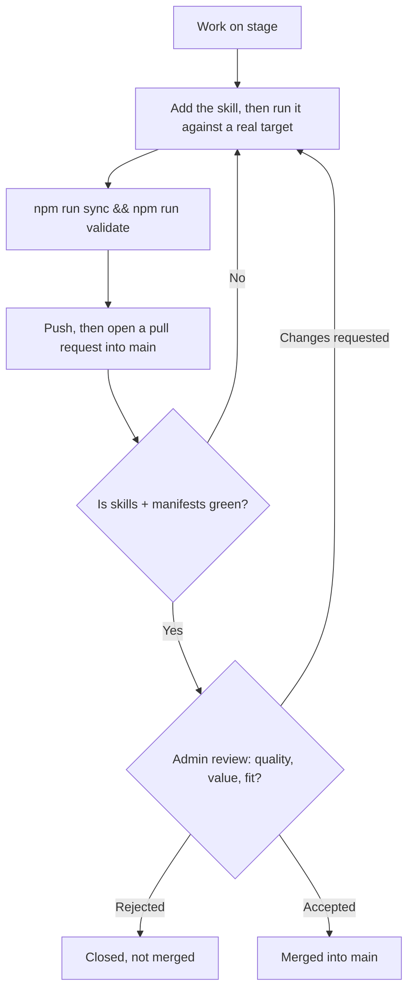

# Contributing

Thanks for adding to this repo. A skill lands here only if it works against a real
target, not just in theory — and an admin decides whether it earns a place in the
collection. [Review criteria](#review-criteria) says what that decision weighs.

<br/>

## Quick path

```bash
git clone https://github.com/apatheticus/skills.git
cd skills
mkdir -p skills/<your-skill>
cp templates/SKILL.template.md skills/<your-skill>/SKILL.md
npm run sync        # registers it in .claude-plugin/plugin.json
npm run validate    # must exit 0
```

Node 18+ is the only prerequisite. There are no dependencies to install:
`scripts/validate.mjs` is plain ESM and runs on the standard library.

<br/>

## Skill layout

```
skills/<name>/
  SKILL.md       # required
  reference/     # optional — long detail, loaded only when linked
  scripts/       # optional — executables the skill invokes
  assets/        # optional — templates, fixtures, examples
```

The directory name **is** the skill name and **is** the slash command. Group
skills in subdirectories (`skills/<group>/<name>/`) only once there are enough to
justify it — the validator and both installers handle nesting.

<br/>

## Frontmatter

Two fields are required; everything else is optional. Full reference:
[`templates/frontmatter.md`](./templates/frontmatter.md).

```yaml
---
name: release-notes
description: Generate release notes from merged PRs since the last tag, grouped by change type. Use when the user asks for release notes, a changelog entry, or says "what shipped since <tag>".
---
```

- `name` — lowercase kebab-case, ≤64 chars, identical to the directory name.
- `description` — ≤1024 chars. **What it does** plus **when to trigger**, including
  the literal phrases a user would say. This is the only text an agent reads when
  deciding whether to load your skill; a vague description means the skill never
  fires. Write it last, after the body exists.

Keep `description` on a single line. `parseFrontmatter` in `scripts/validate.mjs`
reads flat scalar keys only, so a multi-line `description: |` block reads as empty
and fails the required-key check.

Keep colons out of it, or quote the whole value. An unquoted YAML scalar cannot hold
a colon followed by a space — real parsers throw `Nested mappings are not allowed in
compact mappings` and installers skip the file, so the skill goes invisible rather
than failing loudly. `validate` now rejects this, but an em dash usually reads better
anyway.

<br/>

## Writing the body

- **One skill, one job.** If the description needs "and also", split it.
- **Imperative, addressed to the agent.** "Run the suite and fix the first
  failure", not "This skill helps with testing".
- **Open with when *not* to use it.** Name the adjacent skill it gets confused with.
- **Be concrete.** Exact commands, exact paths, exact flags. An agent cannot infer
  your repo's conventions.
- **Keep `SKILL.md` under ~500 lines.** Push depth into `reference/*.md` and link
  it by relative path so it loads on demand. The validator warns past that.
- **Reference bundled files relatively** (`scripts/check.sh`), or as
  `${CLAUDE_PLUGIN_ROOT}/skills/<name>/scripts/check.sh` when the skill runs from
  an installed plugin. Never an absolute path from your machine.
- **State how to verify.** Every skill that changes something should end by
  checking the real artifact — the running app, the rendered output, the actual
  API response — not by declaring success.

<br/>

## Never commit

- Secrets, API keys, tokens, or `.env` contents. This repo is public and every
  installed copy is world-readable.
- Machine-specific absolute paths (`/Users/<you>/...`).
- Destructive commands that run without confirmation (`rm -rf`, force pushes,
  `DROP TABLE`) — gate them behind an explicit user confirmation step.
- Anything that exfiltrates repo contents to a third-party service without saying
  so in the skill body.

<br/>

## Branching model

`main` is the default branch, and it is protected with `enforce_admins` turned on,
which means nobody — including the repo owner — can push to it. It only takes
changes through a pull request. `stage` carries no protection, so day-to-day work
is committed and pushed there directly and reaches `main` by opening a pull
request from it.



`strict` is off, so `stage` does not have to be up to date with `main` before a
merge.

<br/>

## Commit messages

Conventional Commits, lowercase subject, no trailing period. The types already in
use here are `feat`, `docs`, `ci`, and `chore`. Real examples from the history:

```text
feat: add human-voice skill
ci: run validate on stage, document the branch policy
docs: tighten README install section, add removal steps
```

<br/>

## Pull request process

<!-- mpd:viz name="pr-lifecycle" src="docs/assets/src/pr-lifecycle/" facts-hash="89531feffe8bc4da26f2162440c17406dc4c65fed50d676eaa2657e19f9d8f11" src-hash="86e743b4b5e0751b31ca6e81c244a59325b630205772773ba3111427c396cf21" -->
<div align="center">

</div>

<details>
<summary>Diagram source (Mermaid)</summary>



</details>
<!-- mpd:viz end -->

The required status check on `main` is the `validate` workflow's job, whose context
name is **`skills + manifests`**. That string is the job's `name:` in
`.github/workflows/validate.yml`, not the workflow name — renaming the job breaks
branch protection silently, because the old context never reports and the pull
request waits forever. Rename the job and the protection rule together.

A green check makes a pull request *eligible* to merge; it does not merge it. Every
pull request is reviewed by an admin, who accepts it or closes it. Do not merge your
own.

Be aware of how this is enforced, because it is not a review count. `main` requires a
pull request and `enforce_admins` is on, so nobody pushes to it directly — and merging
a pull request needs write access, which only an admin has. The admin-approval
guarantee comes from that access model, not from `required_approving_review_count`,
which stays at `0` deliberately.

It has to stay at `0`. GitHub does not let a pull request author approve their own
pull request, and this repo has exactly one admin, so requiring an approval would mean
no pull request could ever satisfy it — `main` would be unmergeable until protection
was loosened again. Raising the count only makes sense alongside a second admin.

What `main` does enforce: the `skills + manifests` check must be green, and every
review thread must be resolved before the merge button unlocks
(`required_conversation_resolution`). If you leave a comment on your own pull request,
resolve it before merging.

`Closes #N` auto-closes on merges into the default branch, which is `main`, so put
the keyword in the pull request that targets it. Pushing straight to `stage` does
not close anything, however the commit is worded.

Before opening the pull request:

- [ ] `npm run sync && npm run validate` passes locally
- [ ] Skill was run end to end against a real target, and what broke was folded back in
- [ ] `description` says what it does **and** the literal phrases that should trigger it
- [ ] Row added to the Skills table in [README.md](./README.md), all three columns.
      `validate` enforces the link and the `-s <name>` install command; the middle
      column is yours to write — a short human-facing summary, not the frontmatter
- [ ] `version` bumped in `.claude-plugin/plugin.json` — minor for a new skill, patch
      for a fix to an existing one. Plugin installs update on version change.
- [ ] No secrets, tokens, machine-specific absolute paths, or ungated destructive commands

<br/>

## Review criteria

An admin reads every pull request and either accepts it or closes it. The call comes
down to three things:

- **Quality.** Single-purpose, triggered reliably by its description, verified
  against something real rather than declared working, and safe to run in a repo the
  author does not control.
- **Value.** It does something an agent cannot already do well without it. A skill
  that restates default behavior, or that a short prompt covers, is not worth the
  context it costs.
- **Fit.** It belongs in *this* collection. A skill that is sound but specific to one
  team's stack, one private service, or one person's workflow is better published in
  your own repo — `npx skills` and the plugin marketplace both work from any GitHub
  repository, so nothing is lost by hosting it yourself.

A pull request can be closed for fit alone, with no fault in the code. If you would
rather not build against that risk, open an issue describing the skill first and ask
before you write it.

Rejections say which of the three failed and why. If the answer is quality, expect
specifics you can act on and a pull request left open while you do.

<br/>

## Reporting bugs and requesting features

Open an [issue](https://github.com/apatheticus/skills/issues). Say which skill,
which agent host, and what you ran — a skill that fails to trigger and a skill
that triggers and then misbehaves are different bugs. Discussions are not enabled
on this repo.

<br/>

## Security issues

Do not open a public issue for a vulnerability. Report it privately through a
[GitHub Security Advisory](https://github.com/apatheticus/skills/security/advisories/new).
Skills can carry executable `scripts/`, so an unsafe or exfiltrating skill counts
as a security issue, not a bug.

<br/>

## License

This project is licensed under [MIT](./LICENSE). Contributions are accepted under
the same license.

<!-- mpd:footer start -->
<div align="center">
<br/>

**Copyright © 2026 Zerø Effort. Released under the MIT license.**

</div>
<!-- mpd:footer end -->
