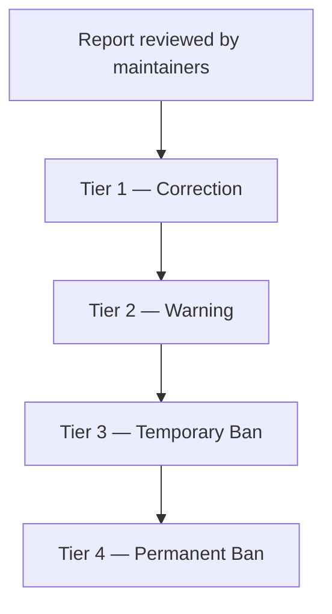

# CODE_OF_CONDUCT spec

This is a **near-canonical document**, not adaptive prose. The house standard is the
**Contributor Covenant, version 2.1**, reproduced faithfully with only a few slots
filled. Don't rewrite, summarize, or "improve" the Covenant text — its wording is
deliberate and widely recognized. Apply [house-style.md](house-style.md) only for the
footer, the one attention banner, and the one added diagram.

## What's fixed vs what varies

**Fixed (reproduce the Contributor Covenant 2.1 verbatim):**
the Pledge, Standards, Enforcement Responsibilities, Scope, Enforcement, the four
Enforcement Guidelines tiers (Correction → Warning → Temporary Ban → Permanent Ban),
and the Attribution section with its links.

**Variable (the only things you fill or adapt):**

- **Attention banner** — the house addition, and the document's *only* designed visual
  (see the visual budget below).
- **Enforcement contact** — *how* to report a conduct concern. This is the one place a
  specific contact appears. Use what the user provides or what `docsmeta` holds (a
  maintainers' channel, an org's HR/management route, an email). If unknown, **ask**
  (it fits the support-channel batch) or leave a clear `<!-- TODO: enforcement
  contact -->`. Note the house guardrail: a named person appears here only if the user
  explicitly designates one — don't default to the repo owner's personal identity.
- **Reporting-channel caveat** — if the project uses the forge's private vulnerability
  reporting for *security* (it does, on GitHub), add the exemplar's clarifying note
  that those advisory channels are for security issues, **not** conduct reports.
- **Enforcement ladder diagram** — the house addition: a `flowchart TD` visualizing the
  four-tier escalation. This is the only Mermaid in the document.
- **Footer** — the shared block.

## Visual budget: one banner, and the covenant stays untouched

CODE_OF_CONDUCT gets **exactly one** designed visual: a single attention banner at the
very top of the document, carrying the document's core expectation —

> **Treat everyone with respect. Harassment and discrimination are not tolerated here.**

The banner is a static designed SVG or a short seamless-loop animated SVG from the
repo's frozen design system (`design-system.md`), produced per `viz-production.md` and
embedded with the `mpd:viz` marker per `embedding.md`. It sits **above** the Covenant
heading. The takeaway must also read in plain text immediately below the banner so the
expectation survives with images off (house-style quality gate: works without images).

Nothing else in the file is visualized. **The Contributor Covenant body text is
reproduced verbatim and is never illustrated, annotated, or animated** — the Pledge,
Standards, Enforcement, and the four guideline tiers stay exactly as written. The
enforcement-ladder `flowchart` and the enforcement-contact guidance from the source
stay as-is; the ladder is plain Mermaid (the four-tier escalation as source of truth),
not part of the designed-visual budget. The banner carries no version, date, or contact
string that could go stale (house-style → No volatile facts).

## Sourcing the canonical text

Reproduce the Contributor Covenant 2.1 text. If you're uncertain of any wording,
fetch it from the authoritative source
(`https://www.contributor-covenant.org/version/2/1/code_of_conduct.html`) rather than
paraphrasing from memory. Keep the Attribution section's links intact:

- homepage — `https://www.contributor-covenant.org`
- Mozilla CoC enforcement ladder — `https://github.com/mozilla/diversity`
- FAQ — `https://www.contributor-covenant.org/faq`
- translations — `https://www.contributor-covenant.org/translations`

The exemplar made one light adaptation — "The examples of unacceptable behavior have
been generalized for this project." — and noted it in Attribution. If you adapt the
examples, disclose it there the same way. Otherwise keep them as-is.

## The added enforcement ladder

Place this after the four guideline tiers:

````markdown
### Enforcement ladder

The four tiers escalate with the severity and persistence of the behavior:


````

## Update behavior

This file rarely drifts — it's standard text. On an update run, the only things to
reconcile are the enforcement contact (if it changed), the security-reporting caveat
(if the forge changed), the footer, and the banner (only if the design system changes).
Leave the Covenant body alone.
