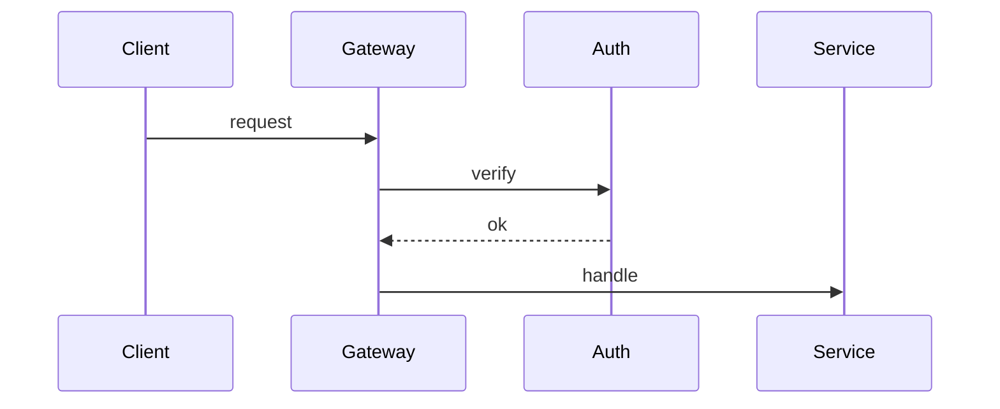

# Embedding — markers, manifests, lazy re-rendering, and the visual audit

Read this before writing any visual embed into a doc, and before any `check` run.
It defines the `mpd:viz` marker family, the per-visual `mpd.json` manifest, the
rules that decide when a visual re-renders, and the audit verdicts.

## Contents

- [Embed shape per doc type](#embed-shape-per-doc-type)
- [Alt-text doctrine](#alt-text-doctrine)
- [The mpd:viz marker](#the-mpdviz-marker)
- [The mpd.json manifest](#the-mpdjson-manifest)
- [Hashes](#hashes)
- [Lazy re-render decision](#lazy-re-render-decision)
- [Adopting visuals from another producer](#adopting-visuals-from-another-producer)
- [Check-mode visual audit](#check-mode-visual-audit)

## Embed shape per doc type

Every visual embed sits inside one `mpd:viz` marker pair. What goes inside the
pair depends on the doc:

**README** (hero + body diagrams) — image with rich alt text, nothing else:

```markdown
<!-- mpd:viz name="hero" src="docs/assets/src/hero/" facts-hash="…" src-hash="…" -->

<!-- mpd:viz end -->
```

**Technical docs** (ARCHITECTURE, DEVELOPMENT, CONTRIBUTING) — image plus the
collapsed Mermaid equivalent, both inside the pair:

```markdown
<!-- mpd:viz name="request-flow" src="docs/assets/src/request-flow/" facts-hash="…" src-hash="…" -->


<details>
<summary>Diagram source (Mermaid)</summary>



</details>
<!-- mpd:viz end -->
```

The Mermaid block must parse (gate 1) and must state the same structure the
animation shows (gate 4). It is the machine-checkable record of what the
animation claims.

**SECURITY / CODE_OF_CONDUCT banners** — one marker pair at the top of the doc,
image only, with the takeaway repeated in plain text immediately below the pair.

**Statics** (non-flagship diagrams, SUPPORT header) — same marker pair, same file
format. A static visual is simply an SVG with no animation block, so it declares
`"loop_s": 0` in its `svg` block. It still gets a full `mpd.json` so the audit can
track its facts and design hash.

**LICENSE / NOTICE — never.** No marker, no image, under any flag.

## Alt-text doctrine

Docs must be fully meaningful with images off (gate 9). Alt text is the
mechanism:

- Alt text states **what the diagram communicates**, not what it looks like.
  "Animated overview: requests enter the gateway and fan out to three services" —
  not "animated diagram with moving dots".
- In README (no Mermaid fallback) the alt text carries the full meaning; write it
  as one or two complete sentences.
- In technical docs the `<details>` Mermaid carries the structure, so alt text can
  be shorter — one sentence naming the subject.
- Banner alt text states the takeaway itself ("Report vulnerabilities privately —
  never in a public issue.").
- No volatile facts in alt text (it's still doc text).

## The mpd:viz marker

```
<!-- mpd:viz name="<slug>" src="<path-to-composition-dir>/" facts-hash="<sha256>" src-hash="<sha256>" -->
…embed content…
<!-- mpd:viz end -->
```

| Attribute | Meaning |
| --- | --- |
| `name` | Kebab-case visual slug. Unique per repo. Matches the asset basename (`docs/assets/<name>.svg`) and the composition dir (`docs/assets/src/<name>/`). |
| `src` | Repo-relative path to the visual's state dir (trailing slash). It holds `mpd.json` and the gitignored `_qa/` scratch — **not** a copy of the SVG. |
| `facts-hash` | Copy of `facts_hash` from `mpd.json` at last render/write. |
| `src-hash` | Copy of `src_hash` from `mpd.json` at last render/write. |

**The asset is the source.** For SVG there is no separate composition to render
from, so nothing under `src/<name>/` duplicates the artwork:

```text
docs/assets/<name>.svg            committed — the asset AND the source; src_hash covers it
docs/assets/src/<name>/mpd.json   committed — facts, hashes, svg params
docs/assets/src/<name>/_qa/       gitignored — filmstrip.html, phase_*.png
docs/assets/src/DESIGN.md         committed — the frozen design system
```

The `src` attribute still points at the state dir, so a repo's marker shape is
identical to the sibling `make-pretty-docs` layout and adoption is a path rewrite
rather than a restructure.

Rules:

- Attributes are double-quoted, in the order shown. One marker pair per visual;
  pairs never nest.
- The marker and its `mpd.json` are written **together, atomically with the
  visual** — once the SVG passes `svg_check.py`, update `mpd.json` first, then
  rewrite the marker with the same hashes. A marker whose hashes disagree with its
  `mpd.json` means someone hand-edited one of them; `check` reports it, apply
  mode treats the visual as stale and re-authors to re-sync.
- Everything between the markers is regenerable wholesale. Prose belongs outside
  the pair.

## The mpd.json manifest

Committed at `docs/assets/src/<name>/mpd.json`:

```json
{
  "name": "request-flow",
  "doc": "ARCHITECTURE.md",
  "tier": "animated-flagship",
  "producer": "more-pretty-docs",
  "style": "swiss-minimal",
  "facts": [
    "Requests enter through src/gateway.ts and are authenticated before routing",
    "Three services handle routed requests: auth, billing, search"
  ],
  "facts_hash": "sha256-of-facts",
  "src_hash": "sha256-of-the-committed-svg",
  "design_hash": "sha256-of-DESIGN.md",
  "svg": { "loop_s": 12, "width": 1200, "bytes": 18422 },
  "relaxed": []
}
```

- `tier`: `animated-flagship` · `animated-hero` · `banner` · `static`.
- `producer`: always `more-pretty-docs` for a visual this skill authored. Any other
  value means the visual came from a different producer — see
  [Adopting visuals from another producer](#adopting-visuals-from-another-producer).
- `style`: the resolved style slug the visual was authored in. Same for every
  visual in a repo; it mirrors `docsmeta.viz.style` and the `## Style` section of
  `DESIGN.md`.
- `facts`: the plain-language, verifiable statements the visual depicts — the
  same facts gate 4 checks against the evidence pass. Order them stably (don't
  reshuffle on rewrite; that would churn the hash). Purely decorative visuals
  (motif texture) get `"facts": []`.
- `svg`: `loop_s` is the declared `data-loop-s` of the file (`0` for a static),
  `width` the viewBox width, `bytes` the committed file size. These are recorded
  facts about the asset, not build parameters — there is no build.
- `relaxed`: the gate relaxations the style declared and the checker actually
  applied, as `["contrast-text@3.0"]`. Empty for a style that relaxes nothing.
  This is what makes softening auditable after the fact.
- No timestamps, no version numbers — the file must not churn between runs.

## Hashes

All hashes are SHA-256 via `shasum -a 256`, first field only.

| Hash | Computed over |
| --- | --- |
| `facts_hash` | The `facts` array joined with `\n` (exact strings, exact order), e.g. `printf '%s\n' "fact one" "fact two" \| shasum -a 256` |
| `src_hash` | The bytes of the committed asset, which *is* the source: `shasum -a 256 docs/assets/<name>.svg` |
| `design_hash` | The bytes of the repo's `docs/assets/src/DESIGN.md` |

## Lazy re-render decision

Computed per visual during the plan phase. **RE-RENDER** iff any of:

1. **Facts changed** — the facts you would state for this visual today (from the
   current evidence pass) hash differently from stored `facts_hash`.
2. **Asset edited** — recomputed `src_hash` of `docs/assets/<name>.svg` ≠ stored.
   Because the asset is the source, a hand-edit to the SVG shows up here.
3. **Design drift** — recomputed `design_hash` of `DESIGN.md` ≠ stored.
4. **Asset missing** — the committed `.svg` doesn't exist at its path.
5. **Marker/manifest mismatch** — marker hashes ≠ `mpd.json` hashes.
6. **Forced** — the run was invoked with `--refresh-viz`.

Otherwise **REUSE**: the embed line may be rewritten (alt text, position) but no
render happens. Consequences worth stating plainly:

- A pure prose edit touches no hash → a full doc pass does **zero renders**.
- Renaming or rewording a fact re-renders its visual — that's correct; the visual
  asserts the fact.
- Editing `DESIGN.md` re-renders **everything** (all visuals derive from it).
  That's why the design system is frozen per run and only re-derived on identity
  change or explicit request.
- **Changing the style is exactly that case.** The style spec lives inside
  `DESIGN.md`, so `--style <something-else>` moves `design_hash` and every visual
  in the repo is re-authored. Say so in the phase-3 plan, with the count, before
  starting.

After re-authoring: write `mpd.json` (new hashes, same stable field order), then
rewrite the marker pair with matching hashes, then confirm the asset passed the
size gate.

## Adopting visuals from another producer

A repo may already carry visuals from the sibling `make-pretty-docs` skill: the
same marker family, the same `mpd.json`, but `.webp` assets rendered through
HyperFrames. The manifests there have no `producer` field, which is how they're
recognised.

Adoption rewrites the embed and leaves the old artefacts alone:

1. Author the replacement `docs/assets/<name>.svg` from the same facts and the same
   `DESIGN.md`, in the resolved style.
2. Rewrite the `` in the marker block from `.webp` to `.svg`. The marker
   attributes and the `src` dir are unchanged.
3. Rewrite `mpd.json` in the new shape: add `producer`, `style`, `relaxed`, replace
   `render` with `svg`, recompute `src_hash` over the new `.svg`.
4. **Report, never delete.** Emit one `ORPHANED` line per leftover — the old
   `docs/assets/<name>.webp`, the composition sources under
   `docs/assets/src/<name>/` (`index.html`, `hyperframes.json`, `package.json`,
   HyperFrames' own `meta.json`), and any HyperFrames scaffold dir. Those are
   committed files that a human may still want; removing them is the user's call,
   not the run's.
5. Leave the sibling's `.gitignore` entries in place. They're harmless, and
   deleting them would dirty the diff of a repo that might revert.

A run that adopts anything says so in the report, with the count of rewritten
embeds and the full orphan list.

## Check-mode visual audit

`check` runs `scripts/audit_visuals.py <doc files…>` and reports one verdict per
visual, plus doc-level findings. The script is mechanical; the **CONTRADICTS**
judgment is yours (it needs the evidence pass).

| Verdict | Meaning | Detected by |
| --- | --- | --- |
| `OK` | Asset present, all hashes consistent, budget respected | script |
| `MISSING` | Embedded asset file absent | script |
| `STALE` | `src_hash` or marker/manifest mismatch (asset edited since it was written) — or, judged by you, `facts_hash` no longer matches current evidence | script + you |
| `DRIFT` | `design_hash` ≠ current `DESIGN.md` (includes any style change) | script |
| `CONTRADICTS` | A stored fact conflicts with what the evidence pass now shows | you — the script prints each visual's `facts` list for judgment |
| `BUDGET` | Doc exceeds its visual budget, the asset exceeds the byte cap, or **any** visual/marker found in LICENSE/NOTICE (hard violation) | script |
| `FOREIGN` | `producer` is absent or is not `more-pretty-docs` — the visual came from another skill and is a candidate for adoption | script |

The audit also prints each visual's `style` and `relaxed` list, so a `check` run
shows what was softened without re-running `svg_check.py` over every asset.

`check` writes nothing — no new assets, no marker edits, no mpd.json updates. The
verdicts feed the report table; in apply mode the same computations feed the
RE-RENDER/REUSE plan.
