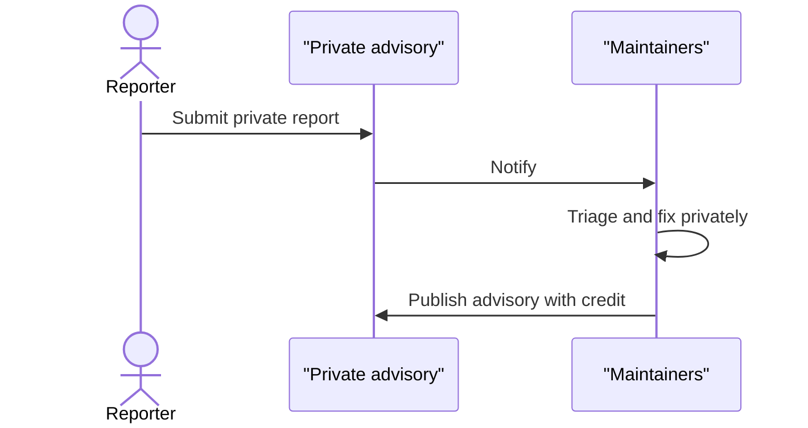

# SECURITY spec

States the project's security posture and — most importantly — **how to report a
vulnerability privately**. The reporting mechanics are host-specific; the posture and
boundary are project-specific. Apply [house-style.md](house-style.md) throughout.

## The reporting channel is the point

The single most important thing this file does is route a reporter to a *private*
channel and away from public issues. Get this right per the detected forge
(house-style → Host awareness):

- **GitHub:** private Security Advisories — link `…/security/advisories/new` directly,
  and tell reporters not to open a public issue.
- **GitLab:** a confidential issue, or a security email.
- **Other / no remote:** a security email from `docsmeta.support.security_email`. If
  none is set, **ask** for one or leave a `<!-- TODO: security contact -->` — never
  invent an address and never fall back to a public issue tracker.

## Visual budget: one banner, nothing else

SECURITY gets **exactly one** designed visual, and no more: a single attention banner
at the very top of the document whose sole job is to make the one takeaway impossible
to miss —

> **Report vulnerabilities privately. Never in a public issue.**

That banner is a static designed SVG or a short seamless-loop animated SVG from the
repo's frozen design system (`design-system.md`), produced per `viz-production.md` and
embedded with the `mpd:viz` marker per `embedding.md`. Everything else in the file —
the supported-versions table, the disclosure flow, the trust boundary — carries **no
designed visual**. A `sequenceDiagram` or `flowchart` may still appear where the
sections below call for it; those are plain Mermaid, not part of this budget.

The banner must not be the *only* place the takeaway lives. Restate it in plain text
right next to the reporting steps so the document still routes reporters correctly with
images turned off (house-style quality gate: works without images). The banner reflects
the private-reporting instruction; it never bakes in a version string, a date, or a
contact address that could go stale (house-style → No volatile facts).

## Section order

| Section | Required? | Drawn from |
| --- | --- | --- |
| Attention banner (private reporting) | required | design system |
| Scope and posture | required | code, evidence pass |
| Supported versions | required | branch model, releases |
| Reporting a vulnerability | required | host |
| Coordinated disclosure flow (sequenceDiagram) | conditional | — |
| Security model / trust boundary (diagram) | conditional | architecture |
| Data handling and privacy | conditional | code |
| Compliance alignment | conditional — only if the project genuinely targets standards | spec, user |
| Dependencies | conditional | manifest |
| Out of scope | conditional | — |
| Footer | required | house-style |

## Section guidance

- **Scope and posture.** An honest description of the real attack surface. If the app
  makes no network calls and holds no secrets, say so — a minimal surface is a fact
  worth stating. Don't overstate hardening that isn't there.
- **Supported versions.** A small table of what receives fixes (e.g. `main` latest:
  yes; older/tags/forks: no). Match the project's real support reality.
- **Reporting a vulnerability.** Numbered steps to the private channel, what to include
  (affected file/route, reproduction, impact), and a realistic acknowledgement
  expectation — phrased as a best-effort goal, not a contractual SLA, unless the
  project actually offers one.
- **Coordinated disclosure flow.** A `sequenceDiagram` (reporter → private advisory →
  maintainers → fix → published advisory). Include when the project follows
  coordinated disclosure.
- **Security model / trust boundary.** A `flowchart` of the trust boundary — what's
  inside, what's external, where data does and doesn't flow. Ground it in the real
  architecture; reuse the boundary shown in ARCHITECTURE.md.
- **Compliance alignment.** Only include if the project genuinely orients to specific
  standards (FISMA, NIST, HIPAA, SOC 2, Section 508, etc.). Be precise about the
  distinction the exemplar draws: a *target* posture vs *active* compliance. Don't
  claim certifications. If no standards apply, omit the section entirely — don't pad.
- **Dependencies.** Name the runtime vs dev dependency surface from the manifest and
  the review posture. Flag native addons if any.
- **Out of scope.** What deliberately doesn't apply (e.g. sample/seed data, local-only
  DoS) so reporters don't file noise.

## Update behavior

The reporting channel and supported-versions table are the high-value facts to keep
current. If the forge or default branch changed, fix those. Dependency lists drift
with the manifest — reconcile them. The banner rarely changes; re-render it only if the
design system or the private-reporting instruction itself changes.

## Neutral exemplar (shape only)

````markdown
<!-- mpd:viz id=security-banner … -->
<div align="center">

</div>
<!-- mpd:viz end -->

# Security policy

## Scope and posture

<Honest description of the real runtime attack surface.>

## Supported versions

| Version | Supported |
| --- | --- |
| `main` (latest) | Yes |
| Older commits, tags, forks | No |

## Reporting a vulnerability

Report privately. Do not open a public issue.

1. <Host-specific private channel — advisory link / confidential issue / email.>
2. Include: affected file or route; steps to reproduce; observed/expected impact.

We aim to acknowledge within a few business days (best-effort).

## Coordinated disclosure flow



## Dependencies

- Runtime: <list>.
- Development: <list>.

<!-- mpd:footer start -->
<!-- … shared footer … -->
<!-- mpd:footer end -->
````
