# claymorphism

**Primary axis:** material · **Aliases:** `clay`, `3d-soft`

<div align="center">

</div>


## Intent

Fat, rounded, pastel volumes that look pressed out of modelling clay — inflated
shapes with a soft inner light and a wide diffuse shadow. Choose it for onboarding,
education, and anything with a friendly consumer register.

## Palette treatment

Pastel and light. Take the repo's accents and use them at high lightness / moderate
saturation as *fills* — clay objects are colored objects. `background` is a very
light tint of the primary accent rather than neutral white. `ink` stays dark enough
to pass contrast on those pastel fills, which usually means near-black, not gray.

**White labels on pastel clay is the canonical failure of this style**, and it is
worth being concrete: white on a lilac `#8B7CF6` measures **3.33:1**, on a rose
`#F58BB6` **2.27:1**, on a mint `#4FC9B0` **2.04:1**. All three look
correct on a bright monitor and all three fail the 4.5:1 floor. Clay is a *light*
material; its type is dark. If a fill is too pale to carry near-black text, the fill
is wrong, not the floor.

## Shape language

The roundest style in the catalog: radius `24–40`, and shapes wider than they are
tall. Nothing sharp, nothing thin. Circles and superellipse-ish rounded rects only.
Elements overlap slightly, like objects on a table.

## Material / depth

Three cues, and they layer:

- **A tinted ambient shadow** — wide, soft, well below the object, in a *saturated
  tint of the object's own hue* rather than neutral grey. Clay sits on a coloured
  world and picks it up; a grey shadow reads as a cutout.
- **A tinted contact shadow** — much tighter and darker, right under the object's
  footprint. Ambient alone floats; contact alone looks stuck. Both together is the
  filter pair, and the reason this style declares a depth of 2.
- **A clipped-ellipse highlight** — an ellipse, not a rounded rect, at about `0.34`
  opacity, clipped to the object and positioned so only its lower arc shows. The arc
  is what reads as light catching a curved surface; a straight-edged highlight reads
  as a rectangle with a lighter top.

## Type treatment

System sans, `700`, generous size. Sentence case, slightly loose tracking (`+0.3`).
Type sits *on* clay objects, so it needs to be big and dark — see the palette
section for what "dark" costs you. No thin weights, no all-caps micro-labels.

## Motion character

Squash-and-stretch, gentle. Objects breathe, tilt a few degrees, or bob a few units —
but only where the bob means something (arrival, selection, activity).

**The easing is load-bearing.** `cubic-bezier(.34,1.56,.64,1)` overshoots past its
target and settles back, and that overshoot is what sells the material; a standard
ease over the same keyframes reads as flat design with big corners. Pair it with a
**damped squash** — four keyframes, the deformation halving each time — and set
`transform-origin` at the object's *bottom*, so it compresses against the surface
rather than around its own middle. `4s` or `6s`. Never fast.

## SVG recipes

An inflated clay card with a clipped inner highlight:

```svg
<defs>
  <!-- ambient + contact, both tinted with the object's own hue -->
  <filter id="soft" x="-40%" y="-40%" width="180%" height="180%">
    <feDropShadow dx="0" dy="18" stdDeviation="16" flood-color="#8f7bd6" flood-opacity="0.28"/>
    <feDropShadow dx="0" dy="4"  stdDeviation="4"  flood-color="#6b56b8" flood-opacity="0.34"/>
  </filter>
  <clipPath id="c1"><rect x="100" y="100" width="300" height="180" rx="34"/></clipPath>
</defs>
<style>
  svg { --background:#f4f0ff; --surface:#c9b8ff; --ink:#1d1533;
        --accent:#ff9ec4; --accent-2:#8ce0d0; --lite:#ffffff; }
  .clay  { fill: var(--surface); filter: url(#soft); }
  .gloss { fill: var(--lite); clip-path: url(#c1); opacity: .34; }
  .t     { fill: var(--ink); font-weight: 700; }
  /* origin at the bottom: it compresses against the table, not around itself */
  .squash{ transform-box: fill-box; transform-origin: 50% 100%;
           animation: squash 6s cubic-bezier(.34,1.56,.64,1) infinite; }
  @keyframes squash {
    0%,100% { transform: translateY(0)     scale(1,    1)    }
    25%     { transform: translateY(-14px) scale(.96,  1.05) }
    55%     { transform: translateY(0)     scale(1.03, .97)  }
    78%     { transform: translateY(-4px)  scale(.99,  1.01) }
  }
  @media (prefers-reduced-motion: reduce) { .squash { animation: none; transform: none } }
</style>

<rect class="clay" x="100" y="100" width="300" height="180" rx="34"/>
<!-- an ellipse, so only its lower arc shows: a curved surface catching light -->
<ellipse class="gloss" cx="250" cy="96" rx="132" ry="52"/>
```

Symmetric keyframes return to the start on their own, so `6s` in a `12s` loop is
seam-exact with no extra work — including the overshoot, because
`cubic-bezier(.34,1.56,.64,1)` is still a function of one cycle.

## Relaxes

| Gate | Default → floor |
| --- | --- |
| filter depth | 1 → **2** chained primitives per element |

Two is the ambient-plus-contact shadow pair. **Contrast is not relaxed**: the pastel
fills still have to carry `ink` at 4.5:1, which is what forces near-black text
instead of the white the style is usually drawn with.

## Never

Sharp corners, thin strokes, dark backgrounds, white or grey text on pastel (see the
measurements above), a neutral-grey shadow, ambient shadow without contact shadow, a
straight-edged highlight where an ellipse arc belongs, `transform-origin: center` on
a squash, a standard ease instead of the overshoot curve, more than three clay
colours in one board, or a bob on something that isn't changing state.
