# flat-material

**Primary axis:** material · **Aliases:** `material`, `flat`




## Intent

Flat color fields with exactly one step of elevation — the Material Design idea,
stripped to what SVG can honestly express. Choose it for apps, SDKs, and design
systems, especially where the product already ships a Material-derived palette.

## Palette treatment

Confident, saturated fields. The accent is a *surface* color, not just a line color —
cards and bars get filled. Two elevation tiers only: `background` for the canvas,
`surface` for anything raised. One `warn` color, used only for warnings.

**The trap this style walks into every time is white text on a mid-value accent.**
The Material palette's amber and orange are the worst offenders: white on `#F9A825`
measures about **1.97:1**, nowhere near the 4.5:1 floor, and it looks right on a
monitor while failing outright. On any accent lighter than roughly `#767676`, the
label goes near-black, not white. Measure the pairing; do not eyeball it.

## Shape language

Rounded rectangles, radius `4–8`, consistent across the board. Circular icon
containers and FAB-like circles are on-idiom. Stroke weight `2` for the rare outline;
most edges are color boundaries, not strokes.

## Material / depth

One drop shadow, one primitive deep, soft and short: offset `0 2`, blur `4`, low
opacity. Raised elements share the *same* shadow — varying it invents elevation tiers
that don't mean anything.

**The shadow is not optional.** A board with no elevation at all is `swiss-minimal`
with rounded corners, not flat-material; the one honest elevation step is the whole
distinction between the two, and dropping it is the most common way this style is
mis-built.

## Type treatment

System sans. Medium (`500`) for labels, `700` for titles, `400` for body. Sentence
case. Slightly loose tracking on small caps-style labels (`+0.5`). Numbers in tabular
figures where they sit in a column.

## Motion character

Purposeful and eased — `cubic-bezier(.4,0,.2,1)`, the Material standard curve. Things
grow from where they are, ripple outward once, or slide along a track. Fills and
opacity, not bounces.

## SVG recipes

The single elevation shadow, defined once and reused:

```svg
<defs>
  <filter id="e1" x="-20%" y="-20%" width="140%" height="140%">
    <feDropShadow dx="0" dy="2" stdDeviation="4" flood-opacity="0.28"/>
  </filter>
</defs>
<style>
  svg { --background:#eceff1; --surface:#ffffff; --ink:#212121; --accent:#1e88e5; --warn:#f4511e; }
  .card { fill: var(--surface); filter: url(#e1); }
  .fill { fill: var(--accent); }
  /* transform-origin in *user units*, not `center`, when the ripple must start
     from the point that was touched rather than the shape's middle */
  .ripple { fill: var(--accent); transform-box: view-box; transform-origin: 640px 300px;
            animation: ripple 3s cubic-bezier(.4,0,.2,1) infinite; }
  @keyframes ripple {
    0%   { transform: scale(.4); opacity: .55 }
    70%  { transform: scale(1.6); opacity: 0 }
    100% { transform: scale(.4); opacity: 0 }
  }
  @media (prefers-reduced-motion: reduce) { .ripple { animation: none; opacity: .55 } }
</style>
```

`3s` divides a `12s` loop four times. The ripple ends invisible, so the reset is
unseen.

## Relaxes

Nothing. One `feDropShadow` is exactly the default filter depth of 1.

## Never

Two different shadow recipes in one repo, no elevation at all, gradients standing in
for elevation, radial gradients at all, white text on a mid-value accent, more than
one accent doing the same job, radius drifting card to card.
