# isometric-3d

**Primary axis:** composition · **Aliases:** `isometric`, `iso`, `axonometric`




## Intent

Axonometric projection: every element is a box seen from the same fixed angle, with a
lit top face, a mid-tone left face and a dark right face, and a flat shadow on the
ground plane. Choose it for anything with genuine *layers* — a stack, a deployment
topology, a tiered architecture — where the third axis carries real information
rather than decoration.

**The projection must mean something.** If height is arbitrary, the reader will still
try to read it as significance. Assign the vertical axis a job — tier, depth, count —
and say what it is in the alt text.

## Palette treatment

Each element gets one hue from the repo's palette, rendered as three values of
itself: top face at full value, left face at about 82%, right face at about 64%.
Ground is a pale neutral (`#F2F1FA`-ish); shadows are one flat neutral at low
opacity, never a blur. Three or four hues on a board, each meaning one thing.

## Shape language

**Radius `0`.** There are no rounded corners in axonometric projection — a rounded
box in this idiom instantly reads as a rendering mistake. Everything is a polygon on
the 30°/150° axes. Strokes are optional; if used, `1` in the darkest value of the
element's own hue, never black. Keep the projection angle identical across every
element on the board.

## Material / depth

Three flat faces, no gradients, no lighting model beyond the fixed three values. The
shadow is a flat parallelogram on the ground plane at about `0.14` opacity, offset
along the projection axes — its *size tracks height*, so a taller stack casts a
shadow further from its base. That relationship is the depth cue; a shadow that
ignores height is what makes bad isometric look pasted on.

## Type treatment

A neutral geometric or grotesque sans — Inter, Helvetica Neue — set **flat, not
projected**. Skewing type onto a face is the single most common way this style fails:
it becomes illegible at rendered scale and unreadable at 360px wide. Labels sit
beside the element, connected by a short leader line, at `20`–`24`, with one `40+`
title. The only permitted exception is a short mono tag on a large top face.

## Motion character

Blocks bobbing gently along the vertical axis, `4s` or `6s`, `ease-in-out`, with
**the shadow shrinking as the block rises** — that coupling is what sells the
projection. Stagger the bob with negative `animation-delay` so the stack breathes
rather than pumping in unison. One packet may travel along a projected connector.

## SVG recipes

A three-face box with a height-tracking shadow:

```svg
<style>
  svg { --ground:#f2f1fa; --a-top:#6f67d6; --a-lft:#5b54b0; --a-rgt:#474189;
        --shade:#2b2740; }
  .ground { fill: var(--ground); }
  .shadow { fill: var(--shade); opacity: .14; transform-box: fill-box;
            transform-origin: center; }
  .lab    { fill: #2b2740; font-family: Inter, -apple-system, 'Segoe UI', sans-serif;
            font-size: 22px; }
  .lead   { stroke: #2b2740; stroke-width: 1; opacity: .5; }
  .bob    { animation: bob 6s ease-in-out infinite; }
  .bob:nth-of-type(2) { animation-delay: -2s }
  .bob:nth-of-type(3) { animation-delay: -4s }
  .shr    { animation: shr 6s ease-in-out infinite; }
  .shr:nth-of-type(2) { animation-delay: -2s }
  @keyframes bob { 0%,100% { transform: translateY(0) } 50% { transform: translateY(-14px) } }
  @keyframes shr { 0%,100% { transform: scale(1);   opacity: .14 }
                   50%     { transform: scale(.86); opacity: .09 } }
  @media (prefers-reduced-motion: reduce) {
    .bob, .shr { animation: none; transform: none; opacity: .14 }
  }
</style>

<ellipse class="shadow shr" cx="360" cy="392" rx="96" ry="30"/>
<g class="bob">
  <path fill="var(--a-top)" d="M360 250 L456 302 L360 354 L264 302 Z"/>
  <path fill="var(--a-lft)" d="M264 302 L360 354 L360 398 L264 346 Z"/>
  <path fill="var(--a-rgt)" d="M456 302 L360 354 L360 398 L456 346 Z"/>
</g>
<line class="lead" x1="470" y1="300" x2="520" y2="286"/>
<text class="lab"  x="528" y="293">ingest tier</text>
```

Three faces from one origin: top is the rhombus, left and right are the same rhombus
edges extruded straight down by the block height. Keep one shared height constant so
every block on the board is the same depth unless depth means something.

## Relaxes

Nothing. Flat faces on a pale ground clear both contrast floors, the style uses at
most one filter, and it is cheap in bytes.

## Never

Rounded corners, a projection angle that varies between elements, skewed text on a
face, a blurred shadow, a shadow that ignores height, a gradient standing in for
lighting, perspective (this is *axonometric* — parallel lines stay parallel), or an
arbitrary vertical axis with no stated meaning.
