# lofi-wireframe

**Primary axis:** composition · **Aliases:** `wireframe`, `greybox`, `lo-fi`

<div align="center">

</div>


## Intent

A greybox: boxes standing in for content, squiggles standing in for text, an X across
a rectangle standing in for an image, all drawn slightly off-true. The point is to
say *the arrangement is decided and the content is not*. Choose it for proposals
under discussion, RFCs, and any diagram whose job is to provoke an argument about
structure rather than present a conclusion.

**This style is honest about being unfinished, and that is a constraint on where it
belongs.** It reads as provisional by design: right for internal review, wrong for a
README hero or a customer deliverable.

## Palette treatment

**Greyscale, plus exactly one selection colour.** Off-white stock (`#F7F7F5`), a
primary grey for line work (`#4A4A4A`), a light grey for placeholder fills and
squiggles (`#9A9A9A`), and one blue (`#2E7BC4`) that marks the single element under
discussion. The repo's brand palette does *not* apply here — colour is the thing this
style deliberately withholds, and reintroducing it defeats the purpose.

## Shape language

Displacement `scale="2.4"` — the sketched end of the roughness dial in `styles.md`,
looser than `codex-leonardo`'s 2.0 and tighter than `whiteboard-marker`'s 4.5.
Radius `0`–`4`. Stroke `1.8` uniform; there is no line-weight hierarchy, because a
greybox has no hierarchy yet. Placeholder image boxes get a corner-to-corner X.

## Material / depth

None. No shadow, no gradient, no blur, no fill beyond flat grey at low opacity. A
wireframe that implies material has stopped being a wireframe. The only filter is the
roughen chain.

## Type treatment

A friendly, obviously-unfinished face — Balsamiq Sans, with Segoe Print and Comic
Sans MS behind it — for the few labels that exist, at `20`–`24`, one `40+` title.

**Body copy is a squiggle, not text.** A repeating quadratic is both cheaper and more
honest than lorem ipsum:

```svg
<path d="M56 146 q6 -5 12 0 t12 0 t12 0 t12 0 t12 0"
      fill="none" stroke="#9A9A9A" stroke-width="1.8"/>
```

The `t` command mirrors the previous control point, so one `q` plus a run of `t`
gives an even wave for a handful of bytes.

**The named faces are never fetched.** On GitHub the chain lands on Segoe Print,
Bradley Hand or Comic Sans MS. Say so rather than promising the exemplar's look; a
remote font `href` or `@import` is a hard gate failure.

## Contrast — read this before choosing it

The placeholder grey (`#9A9A9A` on `#F7F7F5`) measures **2.62:1**, well below
the 4.5:1 floor, and **the floor is not relaxed for this style**. That is deliberate:
placeholder squiggles are decoration and carry no meaning, so they are drawn as
shapes, not `<text>`, and the checker never sees them as type. Every real `<text>` in
a lofi-wireframe uses the `#4A4A4A` primary grey, which clears the floor at
**8.26:1**. If you find yourself wanting light-grey *text*, the content is real and the
wireframe is the wrong style for it.

## Motion character

Almost none, and steady-state. One element — the one under discussion — has its
selection outline's dash pattern creep, or breathes between two opacities at `6s`.
Nothing else moves. **No draw-on entrance**: the sketch is already on the page.

## SVG recipes

```svg
<defs>
  <filter id="rough" x="-8%" y="-8%" width="116%" height="116%">
    <feTurbulence type="fractalNoise" baseFrequency="0.035" numOctaves="2" seed="5" result="n"/>
    <feDisplacementMap in="SourceGraphic" in2="n" scale="2.4"
                       xChannelSelector="R" yChannelSelector="G"/>
  </filter>
</defs>
<style>
  svg { --stock:#f7f7f5; --line:#4a4a4a; --ghost:#9a9a9a; --sel:#2e7bc4; }
  .box   { stroke: var(--line); stroke-width: 1.8; fill: none; filter: url(#rough); }
  .ghost { stroke: var(--ghost); stroke-width: 1.8; fill: none; filter: url(#rough); }
  .sel   { stroke: var(--sel);  stroke-width: 1.8; fill: none; filter: url(#rough);
           stroke-dasharray: 10 6; animation: creep 6s linear infinite; }
  .lab   { fill: var(--line); font-size: 22px;
           font-family: 'Balsamiq Sans', 'Segoe Print', 'Comic Sans MS', cursive; }
  @keyframes creep { from { stroke-dashoffset: 16 } to { stroke-dashoffset: 0 } }
  @media (prefers-reduced-motion: reduce) { .sel { animation: none; stroke-dashoffset: 0 } }
</style>

<rect class="box"   x="80" y="80" width="300" height="180"/>
<path class="ghost" d="M80 80 L380 260 M380 80 L80 260"/>   <!-- image placeholder -->
```

**Never filter the text.** Wobble the shapes only; displacement destroys letterforms.
Expand the filter region (`x="-8%" width="116%"`) or displaced edges clip.

## Relaxes

| Gate | Default → floor |
| --- | --- |
| filter depth | 1 → **2** chained primitives per element |

Two is the roughen chain: turbulence feeding one displacement. **Contrast is not
relaxed** — see the section above; the low-contrast greys are shapes, and every
`<text>` clears 4.5:1.

## Never

The repo's brand colours, a second accent, any shadow or gradient, line-weight
hierarchy, real body copy where a squiggle belongs, light-grey `<text>`, a filtered
`<text>`, a remote font, a draw-on entrance, or use as a README hero.
