# oil-impasto

**Primary axis:** material · **Aliases:** `impasto`, `oil-paint`, `painterly`




## Intent

Paint laid on thick: a lit height field where the relief follows the brush strokes, a
canvas weave showing through, and a gloss travelling across the raised edges. The
heaviest look in the catalog, in filter cost and in mood. Choose it for narrative
pieces, essays, retrospectives, launch posts — visuals whose job is atmosphere, not
specification.

**It is the most expensive style here.** Full-frame turbulence feeding both a
displacement and a lighting model is the slowest thing in this catalog to rasterise.
Above roughly 1600px wide, export to raster rather than shipping live SVG.

## Contrast — read this before choosing it

**Impasto puts mid-tone paint on mid-tone ground, and label contrast fails 4.5:1 on
its native palette. The floor is not relaxed.** So a compliant oil-impasto visual has
to *earn* its labels: put every `<text>` on a solid backing plate — an unpainted
rectangle in the darkest ground tone or a near-white — or ink it far darker than the
painting around it. That plate is not a compromise; it is the same move a painter
makes when they scrape back to the ground to sign a canvas.

Declared honestly: this is a **decorative style**. Use it where the labels carry no
load and the alt text does the work. If your diagram's meaning lives in its labels,
pick something else.

## Palette treatment

A dark warm ground (`#1E1810`) and three pigments from the repo's palette pushed
toward earth: a deep blue (`#2F4B8F`), a burnt orange (`#9C4A24`), and an ochre
(`#C08A2E`). Each pigment appears as a *mass*, not an outline. No pure white and no
pure black anywhere except on a label plate — oil paint has neither.

## Shape language

There are no shapes, only strokes and masses. Radius is meaningless; if a rectangle
is needed, it is a painted block with displaced edges. Every edge is irregular. No
strokes in the SVG sense — the "outline" is a darker pigment mass laid beside a
lighter one.

## Material / depth

**This is the whole style, and the one recipe worth studying.** The *same*
turbulence node is used twice: once as `in2` for the `feDisplacementMap` that breaks
the paint edges, and once as `in` for the `feDiffuseLighting` that raises them.
Because the height field and the paint edges derive from one noise source, the relief
lines up with the strokes. Feeding them separate noise gives texture that visibly
floats above the paint — the single tell of a fake impasto.

Canvas weave is a second, isotropic turbulence (`0.62 0.62`) over the full frame at
`overlay` blend. See the grain-ratio axis in `styles.md`: canvas sits at the
isotropic end of the same dial `brushed-metal` and `wood-grain` sit at.

## Type treatment

An old-style serif, often italic — Bookman Old Style, Georgia, Iowan Old Style — at
`24`–`28`, one `40+` title. **Type is never painted and never filtered**: it sits on
its plate at full opacity, in a value far from the paint around it. Nothing about the
lettering should look like it was made with a brush; the contrast between crisp type
and heavy paint is the composition.

## Motion character

Slow and material. A gloss highlight travelling across the raised edges at `12s`,
`linear`, at low opacity — that is the primary motion and often the only one. A
pigment mass may breathe between two opacities at `6s`. Nothing snaps, nothing
steps, nothing draws itself on.

## SVG recipes

The shared-noise impasto filter — five primitives, and the reason this style declares
a depth of 5:

```svg
<defs>
  <filter id="impasto" x="-6%" y="-6%" width="112%" height="112%">
    <feTurbulence type="fractalNoise" baseFrequency="0.045 0.09" numOctaves="3"
                  seed="12" result="noise"/>
    <feDisplacementMap in="SourceGraphic" in2="noise" scale="9"
                       xChannelSelector="R" yChannelSelector="G" result="paint"/>
    <feDiffuseLighting in="noise" surfaceScale="2.4" diffuseConstant="1.1"
                       lighting-color="#fff5e0" result="relief">
      <feDistantLight azimuth="228" elevation="58"/>
    </feDiffuseLighting>
    <feComposite in="relief" in2="paint" operator="in" result="lit"/>
    <feBlend in="paint" in2="lit" mode="multiply"/>
  </filter>
  <filter id="weave" x="0" y="0" width="100%" height="100%">
    <feTurbulence type="fractalNoise" baseFrequency="0.62 0.62" numOctaves="1" seed="2"/>
    <feColorMatrix type="saturate" values="0"/>
    <feComponentTransfer><feFuncA type="linear" slope="0.16"/></feComponentTransfer>
  </filter>
</defs>
<style>
  .paint { filter: url(#impasto); }
  .canvas{ fill: #cfc6b4; filter: url(#weave); mix-blend-mode: overlay; }
  .plate { fill: #1e1810; }
  .sig   { fill: #f4ecd8; font-family: 'Bookman Old Style', Georgia, serif;
           font-size: 26px; font-style: italic; }
  .gloss { animation: gloss 12s linear infinite; }
  @keyframes gloss { from { transform: translateX(-260px) } to { transform: translateX(1460px) } }
  @media (prefers-reduced-motion: reduce) { .gloss { animation: none } }
</style>

<g class="paint">
  <path fill="#2f4b8f" d="M120 180 h300 v160 h-300 Z"/>
  <path fill="#9c4a24" d="M470 210 h240 v130 h-240 Z"/>
</g>
<rect class="plate" x="120" y="380" width="330" height="46"/>
<text class="sig"   x="140" y="412">ingest</text>
```

## Relaxes

| Gate | Default → floor |
| --- | --- |
| filter depth | 1 → **5** chained primitives per element |

Five is exactly the impasto chain — turbulence, displacement, lighting, composite,
blend — and it is the highest declared floor in the catalog. Nothing else relaxes:
the byte cap, the contrast floor and every structural gate apply unchanged, which is
why the label-plate rule above is mandatory rather than advisory.

## Never

A label without a backing plate or a far-darker ink, a filtered `<text>`, separate
noise sources for displacement and lighting, pure white or pure black in the paint,
crisp geometric edges, stepped or snapping motion, a draw-on entrance, a live SVG
above ~1600px wide, or use for a diagram whose meaning lives in its labels.
