# rough-sketch

**Primary axis:** composition · **Aliases:** `excalidraw`, `roughjs`, `rough`




## Intent

The collaborative whiteboard diagram everyone recognises: every edge drawn twice with
slight divergence, hachure fills at a consistent angle, a friendly hand-lettered
face, and a small tidy palette. It reads as *a diagram someone made in a meeting and
everyone agreed with* — approachable without being sloppy. Choose it for
onboarding, contributor docs, explainers and architecture sketches under discussion.

**Compare `whiteboard-marker`:** that style is genuinely improvised — displacement
4.5, thick round marker strokes, 88% opacity. This one is neater: displacement 2.2,
doubled thin strokes, real fills. If it should look like a finished collaborative
diagram, you're here; if it should look like someone drew it while talking, you're
there.

## Palette treatment

Near-white ground (`#FFFFFF`), ink (`#1e1e1e`), and three stroke colours with three
matching pale fills — blue (`#1971c2` / `#a5d8ff`), red (`#e03131` / `#ffc9c9`),
green (`#2f9e44` / `#b2f2bb`). Map the repo's own palette onto that structure: a
saturated stroke and a very pale tint of the same hue. The pairing is the system;
using a saturated fill breaks it immediately.

## Shape language

Displacement `scale="2.2"` and a second pass at `2.6` — the doubled-stroke position
on the roughness dial in `styles.md`. Radius `0`–`6`. Stroke `1.9`, drawn **twice**.

**Doubled strokes are the single cue that makes a diagram read as this style rather
than generically sketchy.** Draw the shape twice through two filters at different
`seed` values, the second at about `0.65` opacity and offset one unit. One pass reads
as ordinary hand-drawn; two passes read as Rough.js.

## Material / depth

None. No shadow, no gradient, no blur. Fills are **hachure**, not solid: a
`<pattern>` containing one line, rotated by `patternTransform` to **−41°** — the
angle is part of the identity, distinct from drafting's 45° and
`codex-leonardo`'s two unequal angles. A solid fill breaks the style outright.

## Type treatment

A hand-lettered face — Virgil, with Segoe Print and Comic Sans MS behind it — at
`20`–`24` for labels and one `40+` title. Sentence case, generous line spacing,
labels inside their shapes rather than on leaders.

**The named faces are never fetched.** On GitHub the chain lands on Segoe Print,
Bradley Hand or Comic Sans MS — degraded, but still hand-lettered. Say so rather
than promising Virgil; a remote font `href` or `@import` is a hard gate failure, and
subsetting the face as base64 is the fix where fidelity matters.

## Motion character

Steady-state and modest: a packet travelling an arrow at `6s`, `ease-in-out`; a
hachure pattern breathing between two opacities at `12s`. **No draw-on entrance** —
the diagram is already drawn, and animating the linework in is the one move that
makes this style look like a toy.

## SVG recipes

Two seeds, the doubled stroke, and the −41° hachure:

```svg
<defs>
  <filter id="r1" x="-8%" y="-8%" width="116%" height="116%">
    <feTurbulence type="fractalNoise" baseFrequency="0.031" numOctaves="2" seed="1" result="n"/>
    <feDisplacementMap in="SourceGraphic" in2="n" scale="2.2"
                       xChannelSelector="R" yChannelSelector="G"/>
  </filter>
  <filter id="r2" x="-8%" y="-8%" width="116%" height="116%">
    <feTurbulence type="fractalNoise" baseFrequency="0.031" numOctaves="2" seed="14" result="n"/>
    <feDisplacementMap in="SourceGraphic" in2="n" scale="2.6"
                       xChannelSelector="R" yChannelSelector="G"/>
  </filter>
  <pattern id="hachB" width="7" height="7" patternUnits="userSpaceOnUse"
           patternTransform="rotate(-41)">
    <line x1="0" y1="0" x2="0" y2="7" stroke="#a5d8ff" stroke-width="2.2"/>
  </pattern>
</defs>
<style>
  svg { --ink:#1e1e1e; --blue:#1971c2; --red:#e03131; --green:#2f9e44; }
  .p1  { stroke-width: 1.9; fill: none; filter: url(#r1); }
  .p2  { stroke-width: 1.9; fill: none; filter: url(#r2); opacity: .65; }
  .fillB { fill: url(#hachB); filter: url(#r1); }
  .lab { fill: var(--ink); font-size: 22px;
         font-family: Virgil, 'Segoe Print', 'Comic Sans MS', cursive; }
  .flow { animation: flow 6s ease-in-out infinite; }
  @media (prefers-reduced-motion: reduce) { .flow { display: none } }
</style>

<!-- one shape, drawn twice: second pass offset by one unit -->
<rect class="fillB" x="120" y="140" width="240" height="120"/>
<rect class="p1" x="120" y="140" width="240" height="120" stroke="var(--blue)"/>
<rect class="p2" x="121" y="141" width="240" height="120" stroke="var(--blue)"/>
<text class="lab" x="148" y="208">ingest</text>
```

**Never filter the text.** Displacement destroys letterforms; wobble the shapes and
let the hand-lettered face carry the hand. Expand the filter region
(`x="-8%" width="116%"`) or displaced edges clip.

## Relaxes

| Gate | Default → floor |
| --- | --- |
| filter depth | 1 → **2** chained primitives per element |

Two is the roughen chain: turbulence feeding one displacement. Two *filters* on one
shape is the doubled stroke and is fine — the gate counts primitives inside a single
`<filter>`, not filters on the board. Contrast is not relaxed: `#1e1e1e` on white is
about 17:1, and the pale hachure fills never carry text.

## Never

A solid fill where hachure belongs, a single-pass stroke, hachure at 45° (that's
drafting), a shadow or gradient, a saturated fill, a filtered `<text>`, a remote
font, or a draw-on entrance.
