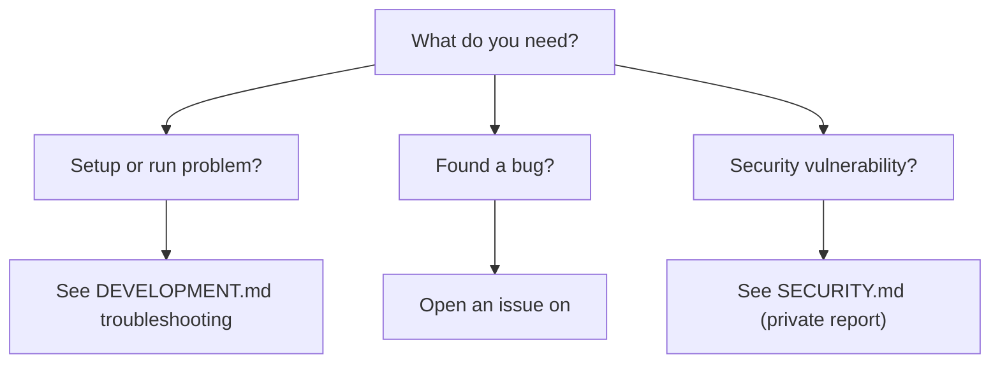

# SUPPORT spec

Tells someone where to go for each kind of help, and sets honest expectations about
what support exists. Short, route-oriented. The channels are host-specific; the FAQ
is project-specific. Apply [house-style.md](house-style.md) throughout.

## Visual budget: a static header at most

SUPPORT is a routing document, not a showcase. Its visual budget is **a single static
designed header at most** — optional, static SVG only, **no animation**. If a header
adds nothing, skip it; a plain `# Support` heading is fine. The "How do I get help?"
decision tree stays a **Mermaid `flowchart` or a static SVG** — never an animated SVG.
No `mpd:viz` animated embeds appear in this file. Any header carries no version or date
(house-style → No volatile facts).

## Section order

| Section | Required? | Drawn from |
| --- | --- | --- |
| Intro (what the project is + support reality) | required | manifest, docsmeta |
| How do I get help? (decision tree) | required | host, doc set |
| Documentation index | required | the doc set |
| Reporting a bug | required | host |
| Asking questions | conditional | host |
| Known limitations and FAQ | conditional | code, spec |
| Briefing / commercial inquiries | conditional — only if applicable | docsmeta |
| Footer | required | house-style |

## Section guidance

- **Intro.** State the support reality plainly. If support is best-effort and routed
  through the issue tracker, say that — don't imply a staffed help desk.
- **How do I get help?** A `flowchart TD` decision tree mapping need → channel: setup
  problem → DEVELOPMENT troubleshooting; bug → issue tracker; vulnerability → SECURITY;
  scope/behavior question → the spec then Issues/Discussions; commercial → the
  configured briefing contact. Adapt the channels to the detected forge.
- **Documentation index.** Link the Tier 1 docs and any authoritative spec, each with a
  half-line. Overlaps with README's Documentation section by design — this is the
  support-shaped entry point.
- **Reporting a bug.** What a good report includes, tuned to the project (the relevant
  state to capture, the route/command, repro steps, expected vs actual, errors). Link
  the real issue tracker. Repeat the "vulnerabilities go to SECURITY, not here" steer.
- **Asking questions.** Point to Issues, and Discussions only if it's actually enabled
  (`docsmeta.support.discussions_enabled`). Don't link a Discussions tab that's off.
- **Known limitations and FAQ.** The genuine constraints a user will hit (platform
  limits, single-user, fixed data, no real connectivity — whatever is actually true).
  This section is honesty in list form; don't soften real limitations.
- **Briefing / commercial.** Include only if there's a real contact route in
  `docsmeta`. Otherwise omit.

## Update behavior

Keep the channels and the doc index current — they break when the forge changes, a
doc is added/removed, or Discussions is toggled. The FAQ drifts as the project's real
limitations change.

## Neutral exemplar (shape only)

````markdown
# Support

<project> — <one line on what it is and the support reality (e.g. best-effort, routed
through the issue tracker)>.

## How do I get help?



## Documentation index

- [README.md](README.md) — what it is and how to run it.
- [DEVELOPMENT.md](DEVELOPMENT.md) — setup and troubleshooting.
- [CONTRIBUTING.md](CONTRIBUTING.md) — how to propose changes.

## Reporting a bug

Open an issue at <tracker>. Include: <project-relevant state>; the route or command;
steps to reproduce; expected vs actual; any errors.

For vulnerabilities, don't open a public issue — follow [SECURITY.md](SECURITY.md).

## Known limitations and FAQ

- **<Real limitation>.** <Plain explanation.>

<!-- mpd:footer start -->
<!-- … shared footer … -->
<!-- mpd:footer end -->
````
