# soft-vinyl

**Primary axis:** material · **Aliases:** `vinyl`, `soft-touch`, `collectible`

<div align="center">

</div>


## Intent

The finish of a soft-touch designer collectible: warm, matte, faintly translucent
where the material thins. Every form is lit by one upper-left key, and the shadow
edge *glows warm* rather than going dark. Choose it for explanatory figures, small
node-and-edge diagrams, and chart series where the bars are the subject.

**And every silhouette is hand-formed, not mathematically perfect.** A ramp and a rim
alone produce a clean product render — correct, and not what this style is. Real
stop-motion puppets and soft-touch figures are *lumpy*: the irregularity is at the scale
of the whole form, not of the surface. So each outline is sampled, displaced by a seeded
low-frequency wobble, and re-splined, which means no edge is straight, no corner is a
true quarter-circle, and no two forms are identical even at the same geometry. The
surface stays entirely grain-free — that distinction is the whole of it, and getting it
wrong in either direction lands somewhere else in the catalog (see Never).

Do not choose it for dense data — the shading costs legibility per element, and past
roughly forty forms the figure reads as clutter. Do not choose it for UI mockups; this
is illustration, not interface.

**The load-bearing idea: volume lives in the fill, not in the shadows.** Delete every
filter from a correct implementation and the forms must still read as solid. If they
flatten, what you built is neumorphism wearing a warm palette. This is testable, and
the gate tests it — see Relaxes.

## Palette treatment

The house ramp is **terracotta** — the warmer, character-led one, and the closer match
to stop-motion reference material. Copied verbatim, not tuned per figure:

| Role | Hex | What it is |
| --- | --- | --- |
| `lit` | `#F8D39F` | the surface facing the key |
| `albedo` | `#E5B981` | true albedo |
| `shade` | `#D69350` | the terminator |
| `deep` | `#AD6E2C` | core shadow, and the slab's depth copy |
| `sss` | `#F2AE78` | subsurface transmission, warm peach |
| `occ` | `#8E5B2B` | contact shadow — warm brown, **never** grey |
| `ground` | `#F7F2E9` | the figure ground |
| `ink` | `#392B18` | label text |
| `inksoft` | `#715533` | secondary text, **ground only** |

**bone** is the second named ramp, for neutral technical figures where terracotta's warmth
would read as decoration: `lit #F7EFE1`, `albedo #E4D7C3`, `shade #CDB69A`, `deep
#B0916A`, `occ #9C7F5E`, with `sss` unchanged. It is the same material at a different
pigment, and everything below applies to it identically except the measured numbers under
Type treatment, which are the terracotta ones and are the tighter set.

**There is no `slablit` and no `caplit`.** Both were hexes brighter than `lit` — the
slab's top stop and the cylinder cap's — and they cannot survive a recolour, because
neither is derivable from a base hue. Both are now just `lit`, which has a consequence
worth stating: `lit` is once again the brightest value in the palette, so "no value on a
form exceeds the brightest declared stop" is true by construction. See Relaxes, where
that same claim used to need a correction.

### Deriving a categorical ramp

Derive, never substitute hexes. Take the new `albedo` in **HSL** and apply:

| Stop | ΔH | ΔS | ΔL |
| --- | --- | --- | --- |
| `lit` | +1.8 | **+20.0** | +9.6 |
| `albedo` | 0 | 0 | 0 |
| `shade` | −3.4 | **−4.2** | −12.5 |
| `deep` | −2.9 | **−7.2** | −27.6 |
| `occ` | −4.4 | **−13.1** | −33.9 |
| `sss` | *absolute* `H 26.6` | *absolute* `S 82.4` | *absolute* `L 71.0` |

Clamp `S` and `L` to `[0, 100]`. Both named ramps are outputs of this table, not
hand-tuned exceptions to it: terracotta is `derive(33.4, 66.4, 70.2)` and bone is
`derive(36.4, 37.9, 82.9)`, each reproducing its six published hexes at **zero channel
delta**. That is the property to check after adding a ramp — if the table cannot
reproduce the ramp you think you derived, one of the two is wrong.

Three rules, all counter-intuitive, all load-bearing:

- **Saturation rises toward the light and falls into shadow.** The instinct is the
  opposite, that shadows are richer. In a translucent material they are not: the dark end
  is filled by low-chroma ambient bounce, and what chroma is there is carried by the `sss`
  layer instead. A ramp that saturates its shadows reads as cheap plastic.
- **Hue drifts warm as value drops**, but only slightly — 3 to 4 degrees, not 20.
- **`sss` is absolute, not relative.** It converges to warm orange whatever the base hue,
  because subsurface colour is a property of the material's scattering rather than its
  pigment: a blue object still transmits warm light. Substituting a hue-matched `sss` is
  the most destructive single error available here.

Cap categorical ramps at four per figure.

**`ink` and `inksoft` are not in the table, and they are not global.** They are set by
measurement against the ramp you derived, which is the one gap the derivation leaves. The
label ground on a slab is the ramp's own `shade` end, so a darker ramp needs a darker ink:
the neutral `#4A3B2A` that clears 5.51:1 on bone measures **4.08:1** on terracotta and
fails. Both terracotta inks are the ramp's own hue (`H 33.4`) dropped in lightness until
the measurement clears — see Type treatment for the method, which is a render sweep, not
arithmetic on the stop hexes.

Figure and ground never share a fill. That separation is precisely what distinguishes
this from neumorphism, where the element *is* the background.

## Shape language

Five primitives cover charts and node diagrams:

| Primitive | Use | Curvature → gradient |
| --- | --- | --- |
| sphere | status badges, cycle nodes | spherical → radial |
| capsule | connectors, pills, tags | cylindrical → linear across the short axis |
| cylinder | the bar-chart primitive, vertical only | cylindrical → linear, horizontal axis |
| slab | the label-bearing form | planar → linear |
| contact shadow | grounds every form | — |

A capsule's corner radius is always `min(w, h) / 2`. **A capsule with square corners is
a slab** — that is the whole distinction, and the gate enforces a radius floor because
of it. A slab's radius is `min(18, h/2)`.

Those radii describe the *nominal* form. What is actually drawn is that outline sampled,
wobbled and re-splined, so the corner radius survives as an intention rather than as a
measurable arc — which is why the radius floor is carried by the forms small enough to
stay primitives (see the amplitude threshold under SVG recipes) and the wobble is gated
separately.

## Material / depth

Four layers per form, always all four, in this draw order:

| # | Layer | Purpose | Omit if |
| --- | --- | --- | --- |
| 1 | contact occlusion | grounds the object | it floats by intent |
| 2 | depth copy | gives a slab its thickness | not a slab |
| 3 | base gradient | models volume | never |
| 4 | subsurface rim | sells the material | never |

Layer 4 is what separates this from generic soft-3D, and it is the first thing an
implementer drops. Real vinyl transmits light through thin sections, so the shadow edge
brightens toward `sss` instead of darkening toward black.

**The rim trick, for any convex form.** Offset the rim gradient's centre *toward* the
light while making its radius *smaller* than the base gradient's. The form's edge then
sits at roughly `0.65` of gradient radius on the lit side and clamps to `1.0` on the
shadow side, so the warm rim appears only where it should, with no masking.

**Mass undulation is a fifth pass, and it belongs with jitter rather than with the four
layers.** A wobbled outline gives a hand-shaped *silhouette*; a hand-shaped *mass* also
varies broadly in tone across its face. Clip four large ellipses to the form, alternating
`shade` and `lit`, each with a radius of 30–55% of the form's long dimension, at opacity
`0.10 × jitter`. Broad and low-amplitude is the entire point: this is the only pass that
touches the interior, and pushed any harder — or made any finer — it becomes the surface
texture the style forbids.

**Gradients are computed from the nominal geometry, never from the wobbled path.** The
displacement is under 5% of the form, so re-deriving axes against the wobble would buy
nothing and would break the one-light-vector invariant, because each form's axis would
then answer to its own seed.

**The cylinder's base ramp starts at `shade`, not `lit`.** Its far-left edge curves away
from the viewer and darkens even though it faces the key. Starting at `lit` produces a
form that reads as a flat ribbon.

**The slab axis is aspect-dependent, and the published formula only holds for a
square-ish slab.** The axis `(x + 0.30w, y) → (x + 0.45w, y + h)` puts a `0.15w`
horizontal run against the full height. That run is subordinate while the slab is
roughly as tall as it is wide — but on a wide slab it dominates, the ramp completes
inside the first sixth of the width, and everything past it clamps to `shade`: the form
reads flat and dark. Clamp the run to `min(0.15w, 0.45h)`, which reduces to the original
exactly when the slab is square-ish and keeps the axis across the **short** dimension,
which the capsule rule already requires. This was found by rendering a 680×64 slab, not
by reading — every slab in the source reference is close enough to square that it never
surfaces.

**Every gradient is `userSpaceOnUse`, with coordinates computed from the instance
geometry.** This is the style's defining invariant and the gate enforces it. SVG's
default, `objectBoundingBox`, resamples the gradient into each element's own box, so a
wide capsule ends up lit as though the light had moved, and no other attribute corrects
it. Because it is the *default*, an omitted `gradientUnits` is a violation rather than a
neutral absence. Allocate gradient IDs from a counter, never from a hash of the
geometry — a collision cross-contaminates two forms silently.

Contact shadows may be shared between forms of identical geometry: the helper derives
the blur from `ry`, so equal geometry yields an identical filter. The unique-ID rule is
about gradients, which carry per-instance coordinates; filters here do not.

## Type treatment

**Text never sits directly on a shaded form.** Contrast varies across a gradient, so a
label that passes at one end fails at the other. Labels go on slabs, whose shading is
deliberately shallow, or on the ground.

**The measurement has to be a render sweep, not arithmetic on the stop hexes**, because
mass undulation composites over the ramp: the ground under a label is the base gradient
*plus* whatever ellipse falls there, so the worst case is a rendered pixel and not a
declared colour. The method: hide the label layer, park the animation at several phases,
and take the **darkest** pixel in each label box — darkest, because the ink is dark on a
light ground, and taking the lightest reports the ground colour rather than the worst
case. Then set `data-bg` to what you measured.

Measured that way across the specimen's five label boxes, terracotta:

| Text | Ground | Ratio |
| --- | --- | --- |
| `ink` | slab's `lit` end | 9.60:1 |
| `ink` | `albedo` | 7.51:1 |
| `ink` | worst measured label box | **5.19:1** |
| `ink` | `ground` | 12.29:1 |
| `inksoft` | `ground` | 6.18:1 |
| `inksoft` | worst measured label box | **2.61:1 — fails** |

The worst box is the leftmost slab's, at a rendered luminance of 34.80 — darker than the
`shade` stop's own 35.74, which is the undulation doing exactly what it is meant to. `ink`
clears with 0.69 to spare; the same slab under the neutral `#4A3B2A` measured **4.08:1**
and failed, which is what forced a derived ink.

`inksoft` is a ground-only role. On a slab it measures 2.61:1 and the gate rejects it.
If an 18px secondary line has to sit on a slab, ink it and separate it by weight.

Per WCAG 1.4.11 a form carrying meaning on its own needs 3:1 against the ground, and
**neither ramp clears it** — terracotta measures `albedo` 1.63:1, `shade` 2.31:1, `deep`
3.73:1, and bone is lower still at 1.27:1 / 1.75:1 / 2.65:1. Terracotta's `deep` is the
one stop in either ramp that does clear 3:1, which is not a licence: it is the core
shadow, so nothing meaningful is ever drawn in it. Every meaningful form must be
labelled, and a data distinction must never be encoded in the shading alone.

## Motion character

One idea: a **stop-motion settle**. A form holds still, squashes once, rebounds past
rest and settles — the take-to-take character of a puppet, not a loop of continuous
motion. Hold for most of the cycle; the settle is the event.

Three constraints, and the third is the non-obvious one.

- Keyframes return to origin at `100%` and never use `alternate`. With a `12s` declared
  loop, a `6s` settle divides it exactly.
- **Do not animate the light.** One light vector for the entire figure is the style's
  second invariant; sweeping it means animating every gradient axis in lockstep, and the
  eye reads the first one that lags as per-object lighting.
- **Keep deformation at or under about 4%.** A baked directional gradient deforms *with*
  the form, so a squashing object's shading squashes too — which is wrong, since the
  light did not move. At 3–4% it is imperceptible and the settle reads correctly. Past
  roughly 8% the shading visibly stretches and the form turns to rubber.
- **Animate the group, never the outline.** The settle scales a `<g>`; the wobbled path
  inside it is untouched, so the silhouette cannot breathe or re-seed between frames. A
  form whose irregularity changes shape over the loop reads as a rendering fault, not as
  hand-made.

Animate the form group only, about its bottom edge (`transform-origin` at the form's
bottom centre). Leaving the label static is deliberate: it stays legible, and text that
squashes reads as a rendering fault.

## SVG recipes

Light vector, derived once and used everywhere:

```
LX, LY = -0.55, -0.72   normalised -> (-0.6070, -0.7948)
```

Sphere, `sphere(cx, cy, r)`:

```
base   radialGradient userSpaceOnUse
       cx + LX*r*0.34, cy + LY*r*0.38, r*1.42
       0% lit · 42% albedo · 76% shade · 100% deep
rim    radialGradient userSpaceOnUse
       cx + LX*r*0.26, cy + LY*r*0.26, r*1.20
       62% sss@0 · 88% sss@0.30 · 100% sss@0.85
contact ellipse (cx, cy + r*0.92), rx r*0.95, ry r*0.22
```

Capsule, `capsule(x, y, w, h)` — radius `min(w,h)/2`:

```
axis   w >= h:  (x + 0.34w, y)      -> (x + 0.60w, y + h)
       else:    (x, y + 0.34h)      -> (x + w, y + 0.60h)
base   linearGradient along axis  0% lit · 38% albedo · 80% shade · 100% deep
rim    linearGradient same axis   66% sss@0 · 100% sss@0.72
contact ellipse (x + w/2, y + 0.98h), rx 0.46w, ry 0.15h
```

The axis runs across the **short** dimension: a long horizontal capsule is lit top to
bottom, not end to end, because cylindrical forms shade across their curvature. Keep the
aspect under about 2:1 on a small connector — the diagonal ramp compresses on anything
longer and the pill reads as a tapered wedge.

Cylinder, `cylinder(x, y, w, h)`, vertical only — `cap_ry = w * 0.17`:

```
body   M x,y  L x,y+h-cap_ry  A w/2,cap_ry 0 0 0 x+w,y+h-cap_ry  L x+w,y  Z
base   linearGradient (x,0) -> (x+w,0)
       0% shade · 22% lit · 58% albedo · 88% shade · 100% deep
rim    linearGradient same axis  70% sss@0 · 100% sss@0.68
cap    ellipse (x + w/2, y), rx w/2, ry cap_ry
       linearGradient (x, y-cap_ry) -> (x+w, y+cap_ry), caplit -> albedo
contact ellipse (x + w/2, y + h), rx 0.62w, ry cap_ry*1.5
```

Slab, `slab(x, y, w, h, depth=9)` — radius `min(18, h/2)`:

```
depth  the same outline translated by (0, depth*0.5), fill deep at 0.55, drawn first
base   linearGradient (x + 0.30w, y) -> (x + 0.30w + min(0.15w, 0.45h), y + h)
       0% lit · 78% albedo · 100% shade
rim    linearGradient (0, y + h - depth*1.4) -> (0, y + h)
       0% sss@0 · 100% sss@0.55
contact ellipse (x + w/2, y + h), rx 0.47w, ry depth*0.9
```

The `albedo` stop sits at **78%**, not 70%. That is a stop *position*, which is the one
thing the extension rules allow you to move, and it is what keeps a label clear of the
floor on a ramp whose `shade` end is dark: at 70% the worst measured box came in under
4.5:1 even with a derived ink. Positions are the lever here; the colours are not.

Form irregularity — `jitter`, and the style's value is **0.85**:

```
1  sample the nominal outline as an ordered point list, walking ONE consistent
   direction — each segment must START where the previous one ENDED
2  resample at uniform arc length
3  drop points closer than 0.75px to their predecessor, including the closing wrap
4  displace each point radially from the centroid by
       d(t) = amp * Σ wᵢ·sin(lᵢ·t + φᵢ) / Σ wᵢ,  t = i/n · 2π
   lobes l = (2, 3, 5), weights w = (1.0, 0.55, 0.3), phases φ from a seeded RNG
5  amp = jitter * size * 0.045, size being the form's short dimension
6  re-smooth through a closed CENTRIPETAL Catmull-Rom spline (α = 0.5) converted
   to cubic beziers; emit as a <path>
```

Three or four lobes, never more: raising the lobe count turns silhouette wobble into
surface noise, which is the one thing this style forbids outright. **Seeds differ per
instance** — three cylinders sharing a seed get identical wobble and read as a repeated
asset rather than three hand-made objects.

**Steps 1, 3 and the α in step 6 are each a distinct defect, and all three produce
self-intersecting outlines.** A traversal that reverses mid-outline — a bottom arc sampled
right-to-left after a left edge running top-to-bottom — makes the point list jump the full
width of the form and back, tearing the silhouette. Coincident points make the
Catmull-Rom tangent `(p2 − p0)/6` degenerate, throwing cusps and loops, and they arise
without anyone writing them: a capsule's corner radius equals half its height, so its side
edges have *zero length* and a naive rounded-rect sampler puts a dozen points on the same
coordinate. And uniform parameterisation (α = 0) is provably loop-prone wherever spacing
changes abruptly, which is every corner of a sampled outline, while centripetal is
provably free of them.

Uniform spacing earns its place twice: it removes the density change that seeds cusps, and
because the wobble is indexed by point number, it keeps the wobble frequency constant
around the perimeter instead of varying with sample density.

**Three divergences from the published recipe, all measured, none aesthetic.**

- **The point count is capped, not the spacing.** Fixing arc-length spacing at 3.5px puts
  423 points on a 680×64 slab and costs 72 KB for one form — this specimen's figure comes
  to roughly 265 KB that way, against a 150 KB ceiling. The wobble is indexed by `t = i/n`
  and is therefore *identical at any n*; only the base outline's corner fidelity degrades.
  So n is capped and the trade is corner precision, which is invisible at embed width, for
  a 3× byte saving.
- **Each outline is emitted once and referenced with `<use>`.** A form draws its outline
  three or four times — base, rim, clip, and a slab's depth copy — and repeating the path
  data is most of the remaining cost. This is not the `<use>` failure the generator-first
  rule is about: that rule forbids `<use>` for *instancing* a primitive at a new size,
  because the gradient would be resampled. Here the geometry and the coordinates are
  identical, so nothing is resampled. A slab's depth copy is the same outline translated,
  which `<use y="…">` expresses exactly.
- **Below about 1px of displacement a form stays a primitive.** `amp = jitter × size ×
  0.045`, so at `jitter 0.85` a form needs a short dimension of roughly 39px before the
  wobble reaches 1.5px. A 24px badge or connector gets 0.9px — invisible, at 5 KB — so
  those keep their `<circle>` and `<rect rx>`. State the threshold rather than leaving it
  implicit: a reader who finds a rect in a hand-formed figure should find the reason next
  to it, and the rects are also what keeps the radius floor reachable.

Contact shadow, the shared helper:

```
blur    feGaussianBlur stdDeviation = ry * 0.55
offset  ox = -LX * rx * 0.16
place   (cx + ox, cy + |LY|*ry*0.30 + ry*0.15)
fill    occ at opacity 0.30 * strength
```

The offset follows the light vector. A contact shadow pointing straight down under an
upper-left key reads as an error even to a viewer who cannot say why. Where one form
occludes another, add a second contact shadow on the occluded form at `strength = 0.6`.

Extending the vocabulary: identify the curvature first, because curvature picks the
gradient type; derive the axis from the geometry and the light vector rather than
hardcoding it; keep the four-stop ramp and adjust stop *positions*, never the colours;
put the rim on the same axis, transparent to 66–70%; and gate the new primitive in
isolation before composing with it.

## Relaxes

**Nothing.** This style runs entirely on the defaults, including `filter_depth: 1` — the
only filter it uses is one `feGaussianBlur` per contact shadow. It is the fidelity
argument in miniature: a material this rich needs no filter chain at all, because the
volume is in the fill.

What it *adds* is stricter than the defaults:

| Gate | Value | Why |
| --- | --- | --- |
| `gradient_units` | `userSpaceOnUse` | the defining invariant, and unreachable by `forbid`, which matches tag names |
| `min_path_curves` | `40` | a hand-formed silhouette is a re-splined path; a perfect one is not |
| `min_rx` | `12` | a square-cornered capsule is a slab |
| `require_filter_all` | `feGaussianBlur` | the contact shadow is not optional |
| `min_elements` | `120` | a specimen has to show the whole vocabulary, wobble and undulation included |
| `forbid` | `feTurbulence` | texture converts vinyl to clay |
| `forbid` | `feSpecularLighting` | a hotspot converts vinyl to polished plastic |
| `forbid` | `feDropShadow` | it offsets uniformly; this style's occlusion follows the light vector |

`min_path_curves` counts **cubic and quadratic segments in the most curved single path**,
and it exists because a silhouette is geometry: no gate reached it, so a clean render of
this same figure — every form a `<rect>`, `<circle>` or arc-cornered path — passed every
other check. That is the flat-render hole `min_filter_depth` closes for filter-built
materials, one layer down. Two details make it work. Arcs deliberately do **not** count:
`A` is precisely what a mathematically perfect rounded corner uses, so counting it would
let the render the floor exists to reject satisfy the floor. And the floor is on the
deepest single path rather than a file-wide total, which makes it scale-free — a
four-form README diagram clears it exactly as a specimen does. Its limit is the same one
`min_filter_depth` has: one conforming outline satisfies it, so a figure that wobbles some
forms and not others still passes. Measured on the previous release's committed specimen,
every path returned **0**.

`gradient_units` also fails a file with **no** gradients at all, which would otherwise
satisfy "every gradient is `userSpaceOnUse`" vacuously — and a soft-vinyl figure with no
gradients is exactly the flat render the key exists to stop.

Note the limits of the machine gate. Forbidding `feSpecularLighting` stops the filter
primitive, not a bright ellipse drawn by hand; and nothing checks that the light vector
is consistent between forms. Both remain hand checks.

**Verifying a render.** Rasterise and measure rather than inspecting: sample a lit and a
shadow point on one form and require the blue channel to drop by at least 40 with red
falling *less* than blue (warm shift); sample a form against the ground and require at
least 8 levels on one channel (not neumorphic); strip every `filter=` attribute,
re-render, and require the first test to still pass (volume is in the fill). That last one
is the important one — it is the formal statement of the intent, and it is what catches an
implementation drifting toward neumorphism.

Two further tests belong to the wobble, and neither is machine-gated here. **Jitter is
silhouette-only:** compare the fine-band standard deviation (`image − blur(3)`) of a
jittered form against the same form at `jitter 0`, and require it within +1.5. Raise the
lobe count or the amplitude far enough and silhouette wobble *becomes* surface noise; this
is what catches it numerically rather than by argument. **No self-intersecting outlines:**
flatten every path to a polyline and test all non-adjacent segment pairs for crossings,
requiring the largest loop under 1.0px. Run that one on the path data, not the raster — a
reversed arc or a degenerate tangent looks like a faint seam once rasterised and is easy
to dismiss, while in the geometry it is unambiguous. Neither is in the gate: the first
needs a rasteriser and the second is real geometry code, so both stay hand checks, and the
byte floor is what stands in for them.

**No specular, and the test the source protocol got wrong.** State it as **peak luminance
on a form ≤ the brightest declared stop**, which is provable for a shading-only render
because a gradient only interpolates between the stops you declared — a specular highlight
is exactly what introduces a value brighter than all of them. Measure it *inside form
interiors*: the ground is lighter than every stop in either ramp, so a whole-canvas peak
reports the ground and proves nothing. Retiring `slablit` and `caplit` is what makes this
clean — they were the only values above `lit`, and their removal is why this specimen
peaks at **69.05**, `lit`'s luminance exactly and not one level over.

## Never

- A gradient without `gradientUnits="userSpaceOnUse"`, including by omission.
- More than one light vector, or an animated one.
- A specular highlight. No tight bright spot anywhere on any form.
- Surface texture of any kind — no turbulence, grain, noise or speckle. Raising the lobe
  count past four is the way this happens by accident.
- A mathematically perfect silhouette on a form large enough to show the wobble. That is
  the clean product render this style exists to replace, and the gate rejects it.
- Uniform Catmull-Rom, an unchecked traversal direction, or coincident points left in the
  sampled outline. Each one produces self-intersecting geometry.
- One seed shared across instances.
- A gradient axis recomputed against the wobbled path rather than the nominal geometry.
- A neutral or grey shadow. Occlusion is warm brown.
- Figure and ground sharing a fill.
- A reused gradient ID.
- Text over a gradient.
- A data distinction carried by shading alone.
- A dark-mode inversion. Baked directional lighting cannot invert and there is no media
  query for it; if a dark variant is needed, ship a second file from a second palette
  block and treat both as illustrations.
