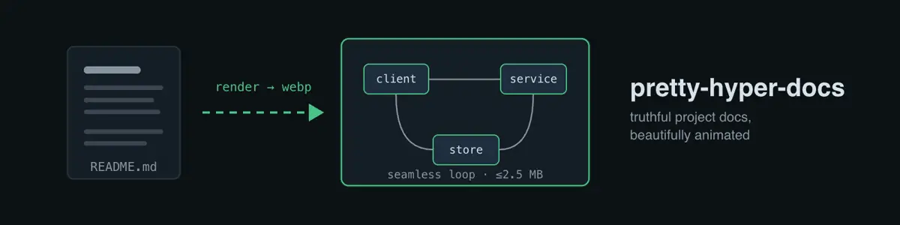
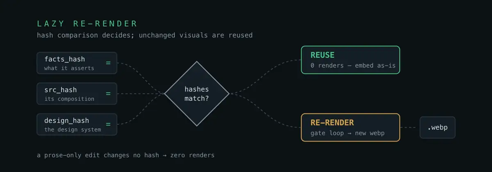

<div align="center">

# pretty-hyper-docs

**A Claude Code skill that writes a repository's standard docs and renders their key diagrams as seamless-loop animated WebPs.**

<!-- pd:badges start -->
[](../../LICENSE)
[](SKILL.md)
[](https://github.com/heygen-com/hyperframes)
<!-- pd:badges end -->

<!-- pd:viz name="hero" src=".prettydocs/src/hero/" facts-hash="8b82995ecc4d715057f2c9b1e7d8c20994532e5c1ca58dca33f7b8d2ae1f6dee" src-hash="f179730ac7cfa15542b3195f4cb8148a7932acf4d280799659f836da5dd5be2e" -->
<div align="center">

</div>
<!-- pd:viz end -->

</div>

## What this is

pretty-hyper-docs creates and maintains a repository's standard documentation —
README, ARCHITECTURE, DEVELOPMENT, CONTRIBUTING, CODE_OF_CONDUCT, SECURITY,
SUPPORT, plus tier-2 files on request — and makes it look designed. Each run
derives a frozen per-repo design system, then renders the docs' key diagrams as
animated WebPs from HTML compositions via
[HyperFrames](https://github.com/heygen-com/hyperframes).

It is a sibling of the `update-docs` skill: the same evidence-first content
engine and the same honesty-over-polish doctrine, with a visual layer on top.
Use `update-docs` for plain text-only docs; use this one when the docs should
also look designed. The hero above and the diagram below were produced by
running the skill on this folder.

## What a run produces

- Tier-1 docs written for their audience, with facts grounded in the repo's
  actual code, manifests, and CI.
- `docs/assets/*.webp` / `*.svg` — the committed visuals, each within a per-doc
  budget (README: hero + up to 3; technical docs: 1–2 flagship each;
  SECURITY/CODE_OF_CONDUCT: one attention banner).
- `.prettydocs/prettydocs.md` — the frozen design system every visual derives
  from (mapped from the product's own brand when it has one).
- `.prettydocs/src/<viz>/` — each visual's composition source and `viz.json`
  manifest; render byproducts are gitignored.

LICENSE and NOTICE are never visualized or reformatted.

## How re-renders are decided

Every embed carries hashes for the facts it depicts, its composition source,
and the design system. A later run re-renders a visual only when one of those
changed, its asset is missing, or `--refresh-viz` forces it:

<!-- pd:viz name="lazy-rerender" src=".prettydocs/src/lazy-rerender/" facts-hash="c486a1a32510117df841321e36914e9f7ed3503a500df704f8314cff7758db9d" src-hash="49449bf4b724b4286418b645e74a2e1ccd1add23e9f4f853f87cd8747ef41f21" -->
<div align="center">

</div>
<!-- pd:viz end -->

## Install

```bash
npx skills add apatheticus/skills --skill pretty-hyper-docs
```

Or as part of the Claude Code plugin bundle:

```
/plugin marketplace add apatheticus/skills
/plugin install apatheticus-skills@apatheticus
```

Or copy the folder straight into a repo's skill directory:

```bash
cp -R skills/pretty-hyper-docs /path/to/repo/.claude/skills/pretty-hyper-docs
```

The skill is self-contained — no other skill needs to be installed. At run
time it requires the HyperFrames toolchain (checked by the preflight gate;
the skill prints install instructions if it's missing) plus `ffmpeg` and
`img2webp` (macOS: `brew install webp`) for rendering.

## Use

| Command | Effect |
| --- | --- |
| `/pretty-hyper-docs` | Full tier-1 pass: content + visuals |
| `/pretty-hyper-docs readme security` | Only the named docs |
| `/pretty-hyper-docs check` | Read-only audit of content and visual staleness |
| `--refresh-viz` / `--no-viz` / `--budget <doc>=<n>` / `--brief` / `--full` | Modifiers — see `SKILL.md` |

## Layout

```
pretty-hyper-docs/
├── SKILL.md              entry point: preflight, workflow, budgets, audience matrix
├── reference/            house style, per-doc specs, design-system / viz-production / embedding doctrine
│   └── tier2/            LICENSE, NOTICE, templates, CODEOWNERS specs
├── scripts/
│   ├── viz_to_webp.sh    deterministic MP4 → animated WebP conversion (enforces the 2.5 MB cap)
│   └── audit_visuals.py  mechanical half of the visual staleness audit
└── docs/assets/          this README's own visuals, produced by the skill itself
```

## License

Released under the [MIT License](../../LICENSE) of the repository that ships it.

<!-- pd:footer start -->
<div align="center">
<br/>

**Copyright © 2026 Zerø Effort. Released under the MIT license.**

</div>
<!-- pd:footer end -->
