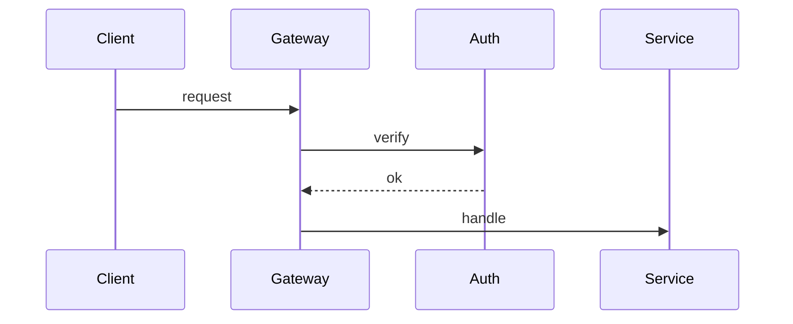

# Embedding — markers, manifests, lazy re-rendering, and the visual audit

Read this before writing any visual embed into a doc, and before any `check` run.
It defines the `pd:viz` marker family, the per-visual `viz.json` manifest, the
rules that decide when a visual re-renders, and the audit verdicts.

## Contents

- [Embed shape per doc type](#embed-shape-per-doc-type)
- [Centering](#centering)
- [Alt-text doctrine](#alt-text-doctrine)
- [The pd:viz marker](#the-pdviz-marker)
- [The viz.json manifest](#the-vizjson-manifest)
- [Hashes](#hashes)
- [Lazy re-render decision](#lazy-re-render-decision)
- [Check-mode visual audit](#check-mode-visual-audit)

## Embed shape per doc type

Every visual embed sits inside one `pd:viz` marker pair. What goes inside the
pair depends on the doc:

**README** (hero + body diagrams) — a centered image with rich alt text, nothing
else:

```markdown
<!-- pd:viz name="hero" src="docs/assets/src/hero/" facts-hash="…" src-hash="…" -->
<div align="center">

</div>
<!-- pd:viz end -->
```

**Technical docs** (ARCHITECTURE, DEVELOPMENT, CONTRIBUTING) — the same centered
image, plus the collapsed Mermaid equivalent inside the pair and **outside** the
centering wrapper:

```markdown
<!-- pd:viz name="request-flow" src="docs/assets/src/request-flow/" facts-hash="…" src-hash="…" -->
<div align="center">

</div>

<details>
<summary>Diagram source (Mermaid)</summary>



</details>
<!-- pd:viz end -->
```

The Mermaid block must parse (gate 1) and must state the same structure the
animation shows (gate 4). It is the machine-checkable record of what the
animation claims.

**SECURITY / CODE_OF_CONDUCT banners** — one marker pair at the top of the doc,
centered image only at `width="100%"`, with the takeaway repeated in plain text
immediately below the pair.

**Static SVGs** (non-flagship diagrams, SUPPORT header) — same marker pair, image
pointing at a committed `.svg` in `docs/assets/`. Static visuals still get a
`viz.json` (their `render` block is omitted) so the audit can track their facts
and design hash.

**LICENSE / NOTICE — never.** No marker, no image, under any flag.

## Centering

**Every embed is centered.** The wrapper is a block element carrying
`align="center"`, it sits *inside* the marker pair, and it wraps the image and
nothing else:

```markdown
<div align="center">
.webp" alt="…" width="820" />
</div>
```

`width` is `820` in a README or technical doc and `100%` for a banner. Three
things make this narrower than it looks:

- **`align` on the wrapper, not `style`.** GitHub's HTML sanitiser strips `style`
  attributes, so `align="center"` on a `<div>` (or `<p>`) is the only centering
  mechanism that survives rendering. Don't reach for `text-align` or a `<center>`
  tag.
- **`align="center"` on the `` itself does not center it.** That attribute is
  inline *vertical* alignment. The footer icon in `house-style.md` uses it for
  exactly that purpose and is correct as written — don't "fix" it, and don't
  mistake it for a centered embed.
- **Markdown image syntax cannot be centered**, which is why a marker-pair embed is
  always an `` tag. `` also carries no width, so it loses the
  size control every doc exemplar depends on.

The wrapper belongs inside the pair, not around it. A README's header block already
sits in a `<div align="center">`, so a hero nested in it looks centered without a
wrapper of its own — but that is inheritance, not the rule: it silently breaks the
moment the embed moves below the header, and it leaves the rule uncheckable from
the marker block alone. Nest the wrapper anyway; `div` inside `div` is valid and
renders identically.

In a technical doc the `<details>` Mermaid block stays outside the centering
wrapper. A fenced code block inside an HTML block element does not parse on
GitHub, and a centered `<summary>` reads as a mistake.

## Alt-text doctrine

Docs must be fully meaningful with images off (gate 9). Alt text is the
mechanism:

- Alt text states **what the diagram communicates**, not what it looks like.
  "Animated overview: requests enter the gateway and fan out to three services" —
  not "animated diagram with moving dots".
- In README (no Mermaid fallback) the alt text carries the full meaning; write it
  as one or two complete sentences.
- In technical docs the `<details>` Mermaid carries the structure, so alt text can
  be shorter — one sentence naming the subject.
- Banner alt text states the takeaway itself ("Report vulnerabilities privately —
  never in a public issue.").
- No volatile facts in alt text (it's still doc text).

## The pd:viz marker

```
<!-- pd:viz name="<slug>" src="<path-to-composition-dir>/" facts-hash="<sha256>" src-hash="<sha256>" -->
…embed content…
<!-- pd:viz end -->
```

| Attribute | Meaning |
| --- | --- |
| `name` | Kebab-case visual slug. Unique per repo. Matches the asset basename (`docs/assets/<name>.webp` or `.svg`) and the composition dir (`docs/assets/src/<name>/`). |
| `src` | Repo-relative path to the composition source dir (trailing slash). For hand-authored static SVGs this dir holds the SVG source and `viz.json`. |
| `facts-hash` | Copy of `facts_hash` from `viz.json` at last render/write. |
| `src-hash` | Copy of `src_hash` from `viz.json` at last render/write. |

Rules:

- Attributes are double-quoted, in the order shown. One marker pair per visual;
  pairs never nest.
- The marker and its `viz.json` are written **together, atomically with the
  render** — after a successful render/conversion, update `viz.json` first, then
  rewrite the marker with the same hashes. A marker whose hashes disagree with its
  `viz.json` means someone hand-edited one of them; `check` reports it, apply
  mode treats the visual as stale and re-renders to re-sync.
- Everything between the markers is regenerable wholesale. Prose belongs outside
  the pair.

## The viz.json manifest

Committed at `docs/assets/src/<name>/viz.json`:

```json
{
  "name": "request-flow",
  "doc": "ARCHITECTURE.md",
  "tier": "animated-flagship",
  "facts": [
    "Requests enter through src/gateway.ts and are authenticated before routing",
    "Three services handle routed requests: auth, billing, search"
  ],
  "facts_hash": "sha256-of-facts",
  "src_hash": "sha256-of-composition-source",
  "design_hash": "sha256-of-DESIGN.md",
  "render": { "duration_s": 10, "fps": 15, "width": 1200, "quality": 68 }
}
```

- `tier`: `animated-flagship` · `animated-hero` · `banner` · `static`.
- `facts`: the plain-language, verifiable statements the visual depicts — the
  same facts gate 4 checks against the evidence pass. Order them stably (don't
  reshuffle on rewrite; that would churn the hash). Purely decorative visuals
  (motif texture) get `"facts": []`.
- `render`: the parameters the WebP was produced with. Omit for static SVGs.
- No timestamps, no version numbers — the file must not churn between runs.

## Hashes

All hashes are SHA-256 via `shasum -a 256`, first field only.

| Hash | Computed over |
| --- | --- |
| `facts_hash` | The `facts` array joined with `\n` (exact strings, exact order), e.g. `printf '%s\n' "fact one" "fact two" \| shasum -a 256` |
| `src_hash` | The bytes of the composition source: `shasum -a 256 index.html` (animated) or the source `.svg` (static) |
| `design_hash` | The bytes of the repo's `docs/assets/src/DESIGN.md` |

## Lazy re-render decision

Computed per visual during the plan phase. **RE-RENDER** iff any of:

1. **Facts changed** — the facts you would state for this visual today (from the
   current evidence pass) hash differently from stored `facts_hash`.
2. **Source edited** — recomputed `src_hash` of the composition source ≠ stored.
3. **Design drift** — recomputed `design_hash` of `DESIGN.md` ≠ stored.
4. **Asset missing** — the committed `.webp`/`.svg` doesn't exist at its path.
5. **Marker/manifest mismatch** — marker hashes ≠ `viz.json` hashes.
6. **Forced** — the run was invoked with `--refresh-viz`.

Otherwise **REUSE**: the embed line may be rewritten (alt text, position) but no
render happens. Consequences worth stating plainly:

- A pure prose edit touches no hash → a full doc pass does **zero renders**.
- Renaming or rewording a fact re-renders its visual — that's correct; the visual
  asserts the fact.
- Editing `DESIGN.md` re-renders **everything** (all visuals derive from it).
  That's why the design system is frozen per run and only re-derived on identity
  change or explicit request.

After a re-render: write `viz.json` (new hashes, same stable field order), then
rewrite the marker pair with matching hashes, then confirm the asset passed the
size gate.

## Check-mode visual audit

`check` runs `scripts/audit_visuals.py <doc files…>` and reports one verdict per
visual, plus doc-level findings. The script is mechanical; the **CONTRADICTS**
judgment is yours (it needs the evidence pass).

| Verdict | Meaning | Detected by |
| --- | --- | --- |
| `OK` | Asset present, all hashes consistent, budget respected | script |
| `MISSING` | Embedded asset file absent | script |
| `UNCENTERED` | The image in the marker block is not wrapped in a centering element — see [Centering](#centering) | script |
| `STALE` | `src_hash` or marker/manifest mismatch (source edited since render) — or, judged by you, `facts_hash` no longer matches current evidence | script + you |
| `DRIFT` | `design_hash` ≠ current `DESIGN.md` | script |
| `CONTRADICTS` | A stored fact conflicts with what the evidence pass now shows | you — the script prints each visual's `facts` list for judgment |
| `BUDGET` | Doc exceeds its visual budget, or **any** visual/marker found in LICENSE/NOTICE (hard violation) | script |

`check` writes nothing — no renders, no marker edits, no viz.json updates. The
verdicts feed the report table; in apply mode the same computations feed the
RE-RENDER/REUSE plan.
