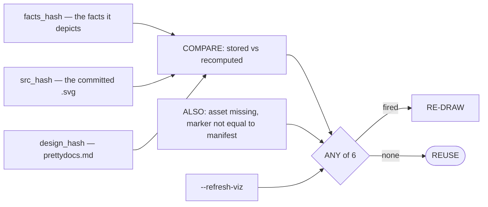

<div align="center">

# pretty-plain-docs

**A Claude Code skill that writes a repository's standard docs and authors their key diagrams as static SVG — nothing to install, and nothing that moves.**

<!-- pd:badges start -->
[](../../LICENSE)
[](SKILL.md)
[](#install)
[](reference/viz-production.md)
[](reference/styles.md)
<!-- pd:badges end -->

<!-- pd:viz name="hero" src=".prettydocs/src/hero/" facts-hash="9101493f7b65ddf14a332a0b630dbb0e8fcce9c4e54ed1e04bb94bf0c688e11b" src-hash="383558ae88daf3cedebc2c3017dcb94e47e39378eb61fb9b34c41101e980464d" -->
<div align="center">

</div>
<!-- pd:viz end -->

</div>

## What this is

pretty-plain-docs creates and maintains a repository's standard documentation —
README, ARCHITECTURE, DEVELOPMENT, DEPLOYMENT, CONTRIBUTING, CODE_OF_CONDUCT,
SECURITY, SUPPORT, plus tier-2 files on request — and makes it look designed.
DEPLOYMENT is signal-gated: it is written only when the repo actually deploys
somewhere, so a library or a docs site correctly gets none. Each run derives a frozen
per-repo design system, picks a named visual style, then writes the docs' key
diagrams as static SVG by hand.

**Still images are the point, not a limitation.** A static `.svg` needs no renderer
cooperation beyond drawing it once, so the same file is correct on GitHub, in a
documentation-site build, in a PDF export, under a print stylesheet, and in a
reviewer's tool that rasterises SVG. Reach for this skill when the docs get printed
or exported, when a moving README is unwanted, or when motion is simply the wrong
register for the project.

It is the third of three siblings that share one content engine and one
honesty-over-polish doctrine, and differ only in the visual layer:

|  | [`pretty-hyper-docs`](../pretty-hyper-docs) | [`pretty-svg-docs`](../pretty-svg-docs) | `pretty-plain-docs` |
| --- | --- | --- | --- |
| Visual format | animated WebP | animated SVG | **static SVG** |
| Needs installing | HyperFrames CLI, ffmpeg, img2webp | nothing beyond `python3` | nothing beyond `python3` |
| Build step | HTML composition → MP4 → WebP | none; the `.svg` you write is the asset | none; the `.svg` you write is the asset |
| Failure mode | preflight STOP on a missing toolchain | warns, never aborts | warns, never aborts |
| Visual style | derived from the product | 32-style catalog, or derived | the same 32-style catalog |
| Asset budget | ≤ 2.5 MB | ≤ 150 KB | ≤ 150 KB |
| Survives print / PDF / rasterising renderer | no | first frame only | **yes, in full** |
| Mermaid source under a README diagram | no | no | **yes** |

Use `pretty-hyper-docs` when you specifically want WebP or name HyperFrames. Use
`pretty-svg-docs` when you want the diagrams to move. Use
[`update-docs`](https://github.com/apatheticus/skills) for plain text-only docs.
Otherwise use this one — and note that every visual on this page was authored and
gated by the skill itself, in the `schematic` style.

Running this skill on a repo whose visuals animate reports them `FOREIGN` and offers
to re-author them as stills; running `pretty-svg-docs` on a repo this skill has
processed does the reverse. That is deliberate, it works in both directions, and
neither skill ever silently claims the other's work — or deletes it.

## What a run produces

- Tier-1 docs written for their audience, with facts grounded in the repo's actual
  code, manifests, and CI.
- `docs/assets/*.svg` — the committed visuals, each within a per-doc budget
  (README: header image + up to 3; technical docs: 1–2 flagship each;
  SECURITY/CODE_OF_CONDUCT: one attention banner).
- A collapsed `<details>` **Mermaid source under every structural visual**, which has
  to parse and has to agree with the SVG node for node.
- `.prettydocs/prettydocs.md` — the frozen design system every visual derives from,
  including the resolved style spec.
- `.prettydocs/src/<viz>/viz.json` — each visual's facts, hashes and parameters.
  There is no composition source next to it, because the asset *is* the source.

LICENSE and NOTICE are never visualized or reformatted.

## Nothing animates, and that is enforced

`data-loop-s="0"` on the root `<svg>` is the static declaration — the same marker the
animated siblings use, so all three skills' output stays mutually intelligible. Here
it is the only permitted value, and it turns the checker into the whole animation ban.
Every one of these is an `ERROR`, not a style deviation:

- any `animation:` or `animation-name:` declaration, **including `animation: none`**;
- any `@keyframes` block, **even one no rule references** — the residue of a careless
  conversion, invisible to a grep for `animation:`;
- any SMIL tag, `<animateMotion>` included (the one the animated sibling permits);
- any `data-loop-s` value other than `0`.

`scripts/svg_check.py` runs six check classes where the animated sibling's runs eight:
the animation ban replaces its seam-arithmetic and motion-accessibility classes.
Everything else is identical — legibility floors, palette conformance, WCAG contrast
with alpha compositing, per-style invariants, the fidelity floor, and the byte caps.

With no motion to carry meaning, the fidelity floor matters *more* here, not less: a
static has only material, draughtsmanship and drawn density to work with, and the
checker reports what each file actually achieved rather than only what it avoided.

## The style catalog

A **style** is the look-and-feel idiom every visual in a repo is rendered in. Pass
`--style <slug>`, or let the skill derive one from the product. Style owns *form* —
shape, material, type, composition. The product's own brand tokens still own the
*palette*.

The catalog is the same 32 idioms the siblings ship, minus their motion vocabulary:
every style here is defined by geometry, material, palette and type, which is exactly
the part a still keeps.

<!-- pd:viz name="styles" src=".prettydocs/src/styles/" facts-hash="3685f2b79d81eac1133f7b531ddbb6ab845e7d35a24406ef02796325706ca3ad" src-hash="0dde81547a6a3b0abe3b5934952a4822d6a8d94b61ea577983d1e61d47ff7ca5" -->
<div align="center">

</div>
<!-- pd:viz end -->

The sheet carries no `<details>` Mermaid block, and that is not an oversight: it is a
catalog index, not a structure with nodes and edges, so there is nothing for a graph
to be equivalent *to*. The A-to-Z table below is its images-off equivalent.

Every cell above **is** that style's own specimen, scaled — not a redrawing of it.
Each specimen is built at 1200 × 460 and gated under its own `--style`, so it gets
that style's real filter floors: `oil-impasto` keeps its five-primitive lit relief,
`wood-grain` its displaced growth rings. Every specimen also ships full-width under
[`docs/samples/`](docs/samples/) and is embedded at the top of its spec file. Aliases
resolve without asking (`brutalist`, `glass`, `soft-ui`, `tui`, `bento`, `excalidraw`,
`hologram`, `patent`, `whiteboard`, …), a recognisable free-form idiom is synthesized
into a full spec and frozen into the repo's `prettydocs.md`, and anything unresolvable
prompts exactly one question.

**Each specimen was converted from the animated original, not redrawn** — the
reduced-motion resting values folded onto the base rules, the keyframes and reduce
blocks deleted, `data-loop-s` flipped to `0`. Geometry, filter chains, palettes and
type are untouched, and every specimen gates to the same verdict it did while moving.
The contact sheet does too: 0 errors, 27 warnings, 34 softened. That equivalence is
the evidence that nothing about a style's fidelity ever depended on it moving.

### Every style, A to Z

Each slug links to its full eight-field spec.

| Style | Axis | What it is |
| --- | --- | --- |
| [`bento-grid`](reference/styles/bento-grid.md) | composition | Unequal cells in one tight grid, each with one job |
| [`blueprint`](reference/styles/blueprint.md) | material | White line work on cyanotype ground, drafted and annotated |
| [`brushed-metal`](reference/styles/brushed-metal.md) | material | Anisotropic grain, a specular sheen, engraved type |
| [`claymorphism`](reference/styles/claymorphism.md) | material | Fat rounded volumes, playful pastel depth |
| [`codex-leonardo`](reference/styles/codex-leonardo.md) | era | Brown ink on aged rag, cross-hatch, mirrored marginalia |
| [`console-elbow`](reference/styles/console-elbow.md) | era | Elbow frame on black, flat colour as zoning |
| [`digital-rain`](reference/styles/digital-rain.md) | era + material | Glyph columns; structure in the negative space |
| [`draughtsman-notebook`](reference/styles/draughtsman-notebook.md) | era | Graphite on gridded stock — precise, but drawn by a person |
| [`editorial`](reference/styles/editorial.md) | composition | Print hierarchy — a lede, a rule, generous margin |
| [`flat-material`](reference/styles/flat-material.md) | material | One elevation step, confident colour fields |
| [`glassmorphism`](reference/styles/glassmorphism.md) | material | Frosted panels over a coloured ground |
| [`holographic-projection`](reference/styles/holographic-projection.md) | material | Glowing wireframe in a projection cone, scanlines |
| [`hud`](reference/styles/hud.md) | composition | Reticles, tick scales, brackets instead of boxes |
| [`ide-dark`](reference/styles/ide-dark.md) | material | Rounded dark panes, hairline dividers, syntax palette |
| [`isometric-3d`](reference/styles/isometric-3d.md) | composition | Three lit faces per block, shadows that track height |
| [`lofi-wireframe`](reference/styles/lofi-wireframe.md) | composition | Greyboxes and squiggles — deliberately unfinished |
| [`maximalist`](reference/styles/maximalist.md) | composition | Density as the message; layered, loud, deliberate |
| [`neo-brutalist`](reference/styles/neo-brutalist.md) | material | Hard offset shadows, black rules, unapologetic colour |
| [`neumorphism`](reference/styles/neumorphism.md) | material | Extruded from one surface; shadow and highlight, no borders |
| [`oil-impasto`](reference/styles/oil-impasto.md) | material | Lit height field, canvas weave, gloss on the raised edges |
| [`patent-drawing`](reference/styles/patent-drawing.md) | era | Black on white, reference characters, no colour at all |
| [`pencil-lined-paper`](reference/styles/pencil-lined-paper.md) | material | Handwriting on ruled stock, graphite grain |
| [`rough-sketch`](reference/styles/rough-sketch.md) | composition | Doubled strokes and hachure fills — the meeting diagram |
| [`schematic`](reference/styles/schematic.md) | composition | Symbol alphabet, net labels, no perspective |
| [`skeuomorphic`](reference/styles/skeuomorphic.md) | material | Objects that look like objects — bevel, sheen, weight |
| [`swiss-minimal`](reference/styles/swiss-minimal.md) | composition | Strict grid, thin rules, type doing the work |
| [`terminal-minimalist`](reference/styles/terminal-minimalist.md) | material | Mono type on a dark field; a TUI that isn't ASCII art |
| [`watercolor`](reference/styles/watercolor.md) | material | Transparent washes that multiply, ink line laid last |
| [`whiteboard-marker`](reference/styles/whiteboard-marker.md) | material | Fat marker strokes at 88% — thinking out loud |
| [`wood-grain`](reference/styles/wood-grain.md) | material | Wandering grain, varnish highlight, burned labels |
| [`y2k-retrofuturist`](reference/styles/y2k-retrofuturist.md) | era | Chrome gradients, wide tracking, optimistic tech |

Two dials cut across the table and are usually the right answer when a request lands
*between* two styles: **roughness** (the hand-drawn family is one displacement scale,
`0.7` ruled → `4.5` improvised) and **grain ratio** (the material family is one
`feTurbulence` x:y ratio, equal → isotropic, extreme → directional).

Three cautions the catalog does not paper over. Display faces are **never fetched**,
so hand-drawn styles degrade to system handwriting on GitHub. `watercolor`,
`oil-impasto` and `lofi-wireframe` are **decorative**: their contrast floor is *not*
relaxed, and each spec names the move that earns its labels back. And
`console-elbow`, `holographic-projection` and `digital-rain` reproduce a visual
language only — the skill declines to add logos, insignia, wordmarks or fictional
alphabets on request rather than treating them as a customisation option.

Full rules and the resolution ladder: [`reference/styles.md`](reference/styles.md).

Where a style's look genuinely fights a soft gate, the style wins and the gate
softens to a **declared floor, never off** — 21 of the 31 relax something, almost
always filter depth, and every relaxation is printed, recorded in `viz.json`, and
named in the run report. `neumorphism` is the only style that relaxes *contrast*.
Structural and truth gates never soften. This skill's own visuals are authored in
`schematic`, one of the ten styles that relax **nothing**, so they prove the base
gates rather than a softened set.

## How re-authoring is decided

Every embed carries hashes for the facts it depicts, the asset itself, and the
design system. A later run rewrites a visual only when one of those changed, its
asset is missing, or `--refresh-viz` forces it:

<!-- pd:viz name="lazy-rerender" src=".prettydocs/src/lazy-rerender/" facts-hash="950c1730949b0eb27b3c6236495cfb49575d2ff54e55a74d3ffaad5022e31bc2" src-hash="2579f895a4564b187231aa609272151ae894f42ecc86aa63d86087c8e1b721d4" -->
<div align="center">

</div>
<!-- pd:viz end -->

<details>
<summary>Diagram source (Mermaid)</summary>



</details>

Because the resolved style spec lives inside `prettydocs.md`, changing the style moves
`design_hash` and re-authors every visual in the repo. The plan phase says so, with
a count, before touching anything.

## Install

```bash
npx skills add apatheticus/skills -s pretty-plain-docs
```

Or as part of the Claude Code plugin bundle:

```
/plugin marketplace add apatheticus/skills
/plugin install apatheticus-skills@apatheticus
```

Or copy the folder straight into a repo's skill directory:

```bash
cp -R skills/pretty-plain-docs /path/to/repo/.claude/skills/pretty-plain-docs
```

The skill is self-contained. At run time it needs `python3` for its two bundled
scripts and nothing else — no renderer, no `ffmpeg`, no CLI, no network. A browser
tool is optional: it is used to look at the rendered pixels, and when none is
available the run says the pixel review was skipped rather than implying it passed.

## Use

| Command | Effect |
| --- | --- |
| `/pretty-plain-docs` | Full tier-1 pass: content + visuals |
| `/pretty-plain-docs readme security` | Only the named docs |
| `/pretty-plain-docs check` | Read-only audit of content and visual staleness |
| `--style <slug>` | Pick a catalog style (or a recognisable free-form idiom) |
| `--style auto` | Re-derive the style from the product, ignoring the stored slug |
| `--refresh-viz` / `--no-viz` / `--budget <doc>=<n>` / `--brief` / `--full` | Modifiers — see `SKILL.md` |

## Charts

Most things a repo wants to "chart" are structural, and belong in a diagram. For the
rest there is a deliberately narrow path in
[`reference/charts.md`](reference/charts.md), gated on provenance: **a plotted value is
allowed only when it derives from a file committed in the repository**, so the next
run can recompute it and notice when it moves. Table counts from a schema, dependency
counts from a manifest, test files per package — those qualify.

Coverage percentages, benchmark timings, download counts and anything with an "as of"
are **refused**, with the reason given. A number rendered into pixels cannot be
greped, diffed in a PR, or corrected by the next person who notices it is wrong, and
a stale one is worse than no chart at all. Those go in prose. Every value that *is*
plotted also appears as its own entry in the visual's `facts` array, so it stays
greppable in the manifest and `facts_hash` moves the moment the data does.

## Layout

```
pretty-plain-docs/
├── SKILL.md              entry point: preflight, workflow, budgets, audience matrix
├── reference/            house style, per-doc specs, design-system / viz-production /
│   │                     charts / embedding doctrine
│   ├── styles.md         the catalog index — read once per run to choose
│   ├── styles/           one full spec per style, read one per run
│   └── tier2/            LICENSE, NOTICE, templates, CODEOWNERS specs
├── scripts/
│   ├── svg_check.py      the gate: structure, the static contract, legibility,
│   │                     palette, contrast, style invariants, fidelity, bytes
│   ├── styles.json       the checker's machine-readable half of the catalog
│   └── audit_visuals.py  mechanical half of the visual staleness audit
└── docs/assets/          this README's own visuals, produced by the skill itself
```

## License

Released under the [MIT License](../../LICENSE) of the repository that ships it.

<!-- pd:footer start -->
<div align="center">
<br/>

**Copyright © 2026 Zerø Effort. Released under the MIT license.**

</div>
<!-- pd:footer end -->
