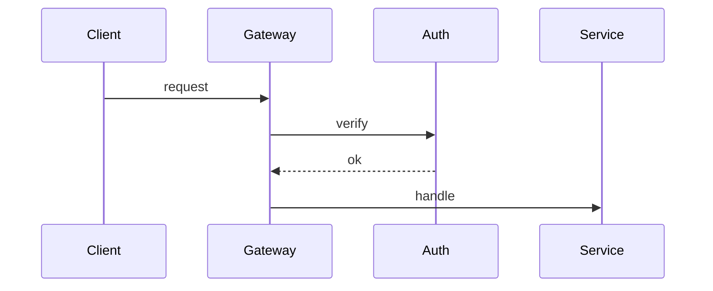

# Embedding — markers, manifests, lazy re-rendering, and the visual audit

Read this before writing any visual embed into a doc, and before any `check` run.
It defines the `pd:viz` marker family, the per-visual `viz.json` manifest, the
rules that decide when a visual re-renders, and the audit verdicts.

## Contents

- [Embed shape per doc type](#embed-shape-per-doc-type)
- [Centering](#centering)
- [Alt-text doctrine](#alt-text-doctrine)
- [The pd:viz marker](#the-pdviz-marker)
- [The viz.json manifest](#the-vizjson-manifest)
- [Hashes](#hashes)
- [Lazy re-render decision](#lazy-re-render-decision)
- [Adopting visuals from another producer](#adopting-visuals-from-another-producer)
- [Check-mode visual audit](#check-mode-visual-audit)

## Embed shape per doc type

Every visual embed sits inside one `pd:viz` marker pair. What goes inside the
pair depends on the doc:

**README header image** — a centered image with rich alt text, nothing else. This is
the one visual in the whole doc set with **no** `<details>` Mermaid block: it states
what the project is rather than a structure with nodes and edges, so there is nothing
for a graph to be equivalent to (`readme.md` → The Mermaid rule):

```markdown
<!-- pd:viz name="hero" src=".prettydocs/src/hero/" facts-hash="…" src-hash="…" -->
<div align="center">

</div>
<!-- pd:viz end -->
```

**Every structural visual** — a README body diagram, a technical-doc diagram
(ARCHITECTURE, DEVELOPMENT, DEPLOYMENT, CONTRIBUTING), or a chart — the same centered
image, followed by the collapsed Mermaid equivalent **after the closing marker,
outside the pair**:

```markdown
<!-- pd:viz name="request-flow" src=".prettydocs/src/request-flow/" facts-hash="…" src-hash="…" -->
<div align="center">

</div>
<!-- pd:viz end -->

<details>
<summary>Diagram source (Mermaid)</summary>



</details>
```

The Mermaid block must parse (gate 1) and must state the same structure the SVG
draws (gate 4). It is the machine-checkable record of what the visual claims, and in
this skill it applies to README body diagrams too — a deliberate divergence from the
animated siblings, argued in `readme.md` → The Mermaid rule.

**Outside the pair, not inside.** Everything between the markers is regenerable
wholesale, and the Mermaid source is *not* regenerated from the SVG — it is authored
alongside it and reviewed as text. Keeping it outside means a re-render replaces the
image without touching a block a human may have edited, and it matches every doc
exemplar in `reference/`. Note that the sibling skills' `embedding.md` puts it inside;
this skill states one position and applies it everywhere.

**SECURITY / CODE_OF_CONDUCT banners** — one marker pair at the top of the doc,
centered image only at `width="100%"`, with the takeaway repeated in plain text
immediately below the pair. A banner is not structural, so it gets no Mermaid block.

**Every visual here is a static**, so `"loop_s": 0` in the `svg` block is universal
rather than a special case — see *The `viz.json` manifest* below.

**LICENSE / NOTICE — never.** No marker, no image, under any flag.

## Centering

**Every embed is centered.** The wrapper is a block element carrying
`align="center"`, it sits *inside* the marker pair, and it wraps the image and
nothing else:

```markdown
<div align="center">
.svg" alt="…" width="820" />
</div>
```

`width` is `820` in a README or technical doc and `100%` for a banner. Three
things make this narrower than it looks:

- **`align` on the wrapper, not `style`.** GitHub's HTML sanitiser strips `style`
  attributes, so `align="center"` on a `<div>` (or `<p>`) is the only centering
  mechanism that survives rendering. Don't reach for `text-align` or a `<center>`
  tag.
- **`align="center"` on the `` itself does not center it.** That attribute is
  inline *vertical* alignment. The footer icon in `house-style.md` uses it for
  exactly that purpose and is correct as written — don't "fix" it, and don't
  mistake it for a centered embed.
- **Markdown image syntax cannot be centered**, which is why a marker-pair embed is
  always an `` tag. `` also carries no width, so it loses the
  size control every doc exemplar depends on.

The wrapper belongs inside the pair, not around it. A README's header block already
sits in a `<div align="center">`, so a hero nested in it looks centered without a
wrapper of its own — but that is inheritance, not the rule: it silently breaks the
moment the embed moves below the header, and it leaves the rule uncheckable from
the marker block alone. Nest the wrapper anyway; `div` inside `div` is valid and
renders identically.

The `<details>` Mermaid block stays outside the centering wrapper — and, in this
skill, outside the marker pair entirely. A fenced code block inside an HTML block
element does not parse on GitHub, and a centered `<summary>` reads as a mistake.

## Alt-text doctrine

Docs must be fully meaningful with images off (gate 9). Alt text is the
mechanism:

- Alt text states **what the diagram communicates**, not what it looks like.
  "Overview: requests enter the gateway and fan out to three services" — not
  "diagram with boxes and arrows".
- For the README header image (the one visual with no Mermaid fallback) the alt text
  carries the full meaning; write it as one or two complete sentences.
- For any structural visual the `<details>` Mermaid carries the structure, so alt text
  can be shorter — one sentence naming the subject.
- Banner alt text states the takeaway itself ("Report vulnerabilities privately —
  never in a public issue.").
- No volatile facts in alt text (it's still doc text).

## The pd:viz marker

```
<!-- pd:viz name="<slug>" src="<path-to-composition-dir>/" facts-hash="<sha256>" src-hash="<sha256>" -->
…embed content…
<!-- pd:viz end -->
```

| Attribute | Meaning |
| --- | --- |
| `name` | Kebab-case visual slug. Unique per repo. Matches the asset basename (`docs/assets/<name>.svg`) and the state dir (`.prettydocs/src/<name>/`). |
| `src` | Repo-relative path to the visual's state dir (trailing slash). It holds `viz.json` and the gitignored `_qa/` scratch — **not** a copy of the SVG. |
| `facts-hash` | Copy of `facts_hash` from `viz.json` at last render/write. |
| `src-hash` | Copy of `src_hash` from `viz.json` at last render/write. |

**The asset is the source.** For SVG there is no separate composition to render
from, so nothing under `src/<name>/` duplicates the artwork:

```text
docs/assets/<name>.svg              committed — the asset AND the source; src_hash covers it
.prettydocs/src/<name>/viz.json     committed — facts, hashes, svg params
.prettydocs/src/<name>/_qa/         gitignored — verification screenshots
.prettydocs/prettydocs.md           committed — the frozen design system
```

The `src` attribute still points at the state dir, so a repo's marker shape is
identical to the sibling `pretty-hyper-docs` layout and adoption is a path rewrite
rather than a restructure.

Rules:

- Attributes are double-quoted, in the order shown. One marker pair per visual;
  pairs never nest.
- The marker and its `viz.json` are written **together, atomically with the
  visual** — once the SVG passes `svg_check.py`, update `viz.json` first, then
  rewrite the marker with the same hashes. A marker whose hashes disagree with its
  `viz.json` means someone hand-edited one of them; `check` reports it, apply
  mode treats the visual as stale and re-authors to re-sync.
- Everything between the markers is regenerable wholesale. Prose belongs outside
  the pair.

## The viz.json manifest

Committed at `<project>/.prettydocs/src/<name>/viz.json`:

```json
{
  "name": "request-flow",
  "doc": "ARCHITECTURE.md",
  "tier": "static-header",
  "producer": "pretty-plain-docs",
  "style": "swiss-minimal",
  "facts": [
    "Requests enter through src/gateway.ts and are authenticated before routing",
    "Three services handle routed requests: auth, billing, search"
  ],
  "facts_hash": "sha256-of-facts",
  "src_hash": "sha256-of-the-committed-svg",
  "design_hash": "sha256-of-prettydocs.md",
  "design_source_path": "docs/brand/DESIGN.md",
  "design_source_hash": "sha256-of-that-source",
  "svg": { "loop_s": 0, "width": 1200, "bytes": 18422 },
  "relaxed": []
}
```

- `tier`: `static-header` · `static` · `banner`.
- `producer`: always `pretty-plain-docs` for a visual this skill authored, and that is
  the **only** owned value — this skill has never shipped under another name, so there
  is no legacy alias to accept. Any other value, and an absent field, means the visual
  came from a different producer; the siblings' values are `pretty-svg-docs` /
  `more-pretty-docs` (animated SVG) and absent (`pretty-hyper-docs`, animated WebP).
  See [Adopting visuals from another producer](#adopting-visuals-from-another-producer).
- `style`: the resolved style slug the visual was authored in. Same for every
  visual in a repo; it mirrors `docsmeta.viz.style` and the `## Style` section of
  `prettydocs.md`.
- `facts`: the plain-language, verifiable statements the visual depicts — the
  same facts gate 4 checks against the evidence pass. Order them stably (don't
  reshuffle on rewrite; that would churn the hash). Purely decorative visuals
  (motif texture) get `"facts": []`.
- `design_source_path` / `design_source_hash`: **optional**, written only when the
  design system was derived from something upstream rather than authored fresh —
  the repo-relative path the discovery ladder landed on, and its hash at derivation
  time. Omit both when there was no prior identity.
- `svg`: `loop_s` is the declared `data-loop-s` of the file, always `0` here,
  `width` the viewBox width, `bytes` the committed file size. These are recorded
  facts about the asset, not build parameters — there is no build.
- `relaxed`: the gate relaxations the style declared and the checker actually
  applied, as `["contrast-text@3.0"]`. Empty for a style that relaxes nothing.
  This is what makes softening auditable after the fact.
- No timestamps, no version numbers — the file must not churn between runs.

## Hashes

All hashes are SHA-256 via `shasum -a 256`, first field only.

| Hash | Computed over |
| --- | --- |
| `facts_hash` | Each `facts` entry followed by a newline — exact strings, exact order, **including the trailing newline** after the last one: `printf '%s\n' "fact one" "fact two" \| shasum -a 256` |
| `src_hash` | The bytes of the committed asset, which *is* the source: `shasum -a 256 docs/assets/<name>.svg` |
| `design_hash` | The bytes of the project's `.prettydocs/prettydocs.md` — the frozen contract, wherever it was derived from |
| `design_source_hash` | The bytes of the upstream source named by `design_source_path`, as of derivation. Optional |

Because every one of these is taken over file **bytes**, moving a file without
editing it yields the same hash. That is what makes the `.prettydocs/` migration a
path rewrite rather than a re-author.

`design_hash` covers `prettydocs.md` **only** — never the source it was derived
from. That separation is the point: a repo's own upstream design file may churn for
reasons that have nothing to do with doc visuals, and letting it drive `design_hash`
would re-author everything each time. See `design-system.md` → A hit below rung 2 is
a source, never the contract.

### Upstream drift is a warning, not a re-render

When `design_source_path` is set, recompute `design_source_hash` on each run. A
mismatch means the upstream identity moved on: **warn and offer to re-derive**
`prettydocs.md`. Do not re-author on it, and do not silently update the stored hash
— that would discard the only signal that the two have diverged. Only `design_hash`
participates in the decision below.

## Lazy re-render decision

Computed per visual during the plan phase. **RE-RENDER** iff any of:

1. **Facts changed** — the facts you would state for this visual today (from the
   current evidence pass) hash differently from stored `facts_hash`.
2. **Asset edited** — recomputed `src_hash` of `docs/assets/<name>.svg` ≠ stored.
   Because the asset is the source, a hand-edit to the SVG shows up here.
3. **Design drift** — recomputed `design_hash` of `prettydocs.md` ≠ stored.
4. **Asset missing** — the committed `.svg` doesn't exist at its path.
5. **Marker/manifest mismatch** — marker hashes ≠ `viz.json` hashes.
6. **Forced** — the run was invoked with `--refresh-viz`.

Otherwise **REUSE**: the embed line may be rewritten (alt text, position) but no
render happens. Consequences worth stating plainly:

- A pure prose edit touches no hash → a full doc pass does **zero renders**.
- Renaming or rewording a fact re-renders its visual — that's correct; the visual
  asserts the fact.
- Editing `prettydocs.md` re-renders **everything** (all visuals derive from it).
  That's why the design system is frozen per run and only re-derived on identity
  change or explicit request.
- **Changing the style is exactly that case.** The style spec lives inside
  `prettydocs.md`, so `--style <something-else>` moves `design_hash` and every visual
  in the repo is re-authored. Say so in the phase-3 plan, with the count, before
  starting.

After re-authoring: write `viz.json` (new hashes, same stable field order), then
rewrite the marker pair with matching hashes, then confirm the asset passed the
size gate.

## Adopting visuals from another producer

A repo may already carry visuals from either sibling. All three skills share the
marker family and the `viz.json` shape, so adoption is a rewrite, never a
restructure. The `producer` field is how ownership is decided:

| `producer` in `viz.json` | Verdict here | What it was |
| --- | --- | --- |
| `pretty-plain-docs` | owned | this skill |
| `pretty-svg-docs` or `more-pretty-docs` | `FOREIGN` | animated SVG |
| absent | `FOREIGN` | `pretty-hyper-docs` — animated WebP via HyperFrames, which writes no `producer` |
| anything else | `FOREIGN` | unknown producer; adopt only with the user's go-ahead |

**The `FOREIGN` verdict is mutual by design, and that is the migration path.** This
skill reports the siblings' visuals `FOREIGN` and offers to re-author them as statics;
`pretty-svg-docs` reports this skill's visuals `FOREIGN` and offers to animate them.
Neither silently claims the other's work, and a repo can move in either direction. So
`FOREIGN` here means "authored by a sibling, convertible" — not "broken".

Adoption rewrites the embed and leaves the old artefacts alone:

1. Author the replacement `docs/assets/<name>.svg` from the same facts and the same
   `prettydocs.md`, in the resolved style. **From an animated SVG this is a
   conversion, not a redraw** — fold each reduced-motion resting value onto its base
   rule and delete the motion (`viz-production.md` → The animation ban). Geometry,
   palette, type and filter chains carry over untouched, so the static is recognisably
   the same visual. From a WebP it is fresh authoring: there is no vector source to
   convert.
2. Rewrite the `` in the marker block to `.svg`, and add the centering
   wrapper if the old embed lacked one. The marker attributes and the `src` dir are
   unchanged.
3. Add the `<details>` Mermaid block after the closing marker if the visual is
   structural and the sibling left none — the siblings do not require one on a README
   body diagram and this skill does (`readme.md` → The Mermaid rule).
4. Rewrite `viz.json`: set `producer` to `pretty-plain-docs`, set `"loop_s": 0`, keep
   `style` and `relaxed`, replace `render` with `svg` if it came from HyperFrames, and
   recompute `src_hash` over the new `.svg`.
5. **Report, never delete.** Emit one `ORPHANED` line per leftover — the old
   `docs/assets/<name>.webp`, the composition sources under
   `.prettydocs/src/<name>/` (`index.html`, `hyperframes.json`, `package.json`,
   HyperFrames' own `meta.json`), and any HyperFrames scaffold dir. Those are
   committed files that a human may still want; removing them is the user's call,
   not the run's. An animated `.svg` being replaced is itself an orphan under this
   rule: report it, leave it on disk.
6. Leave the sibling's `.gitignore` entries in place. They're harmless, and
   deleting them would dirty the diff of a repo that might revert.

A run that adopts anything says so in the report, with the count of rewritten
embeds and the full orphan list. **Adoption is never automatic**: a repo whose
visuals animate chose animation, so confirm the switch to stills with the user before
rewriting anything.

## Check-mode visual audit

`check` runs `scripts/audit_visuals.py <doc files…>` and reports one verdict per
visual, plus doc-level findings. The script is mechanical; the **CONTRADICTS**
judgment is yours (it needs the evidence pass).

| Verdict | Meaning | Detected by |
| --- | --- | --- |
| `OK` | Asset present, all hashes consistent, budget respected | script |
| `MISSING` | Embedded asset file absent | script |
| `UNCENTERED` | The image in the marker block is not wrapped in a centering element — see [Centering](#centering) | script |
| `STALE` | `src_hash` or marker/manifest mismatch (asset edited since it was written) — or, judged by you, `facts_hash` no longer matches current evidence | script + you |
| `DRIFT` | `design_hash` ≠ current `prettydocs.md` (includes any style change) | script |
| `CONTRADICTS` | A stored fact conflicts with what the evidence pass now shows | you — the script prints each visual's `facts` list for judgment |
| `BUDGET` | Doc exceeds its visual budget, the asset exceeds the byte cap, or **any** visual/marker found in LICENSE/NOTICE (hard violation) | script |
| `FOREIGN` | `producer` is anything other than `pretty-plain-docs`, including absent — the visual came from a sibling (animated SVG or WebP) or an unknown producer, and is a candidate for adoption. Convertible, not broken; never deleted | script |

The audit also prints each visual's `style` and `relaxed` list, so a `check` run
shows what was softened without re-running `svg_check.py` over every asset.

`check` writes nothing — no new assets, no marker edits, no viz.json updates. The
verdicts feed the report table; in apply mode the same computations feed the
RE-RENDER/REUSE plan.
