# glassmorphism

**Primary axis:** material · **Aliases:** `glass`, `frosted`, `aero`

<div align="center">

</div>


## Intent

Frosted translucent panels floating over a colored, blurred ground — depth through
transparency. Choose it for media projects, overlay-heavy UIs, and showcase repos
where the visual is partly the product. It costs the most bytes of any style here
except `maximalist`; read the recipe before committing.

## Palette treatment

The **ground** carries the color: two or three large accent blobs at high saturation,
heavily blurred. Panels are near-white or near-black at `12–20%` opacity with a `1`px
`50%`-opacity light border. `ink` must be near-solid — text is the one thing that is
never translucent.

## Shape language

Radius `12–20` on panels. Large soft blobs behind, crisp rectangles in front. Panel
borders are the only strokes, always `1`, always a light tint at partial opacity.

**The edge stroke is a gradient, not a flat colour.** A real pane catches light on
two adjacent edges and loses it on the other two, so run a diagonal
`<linearGradient>` from about `0.75` opacity down to `0.12` along the border. A flat
`0.45` stroke reads as an outlined rectangle; the ramp reads as glass.

## Material / depth

Here is the constraint that shapes everything: **SVG has no `backdrop-filter`.** A
panel cannot blur what is behind it. The workaround is to draw the blurred ground
**twice** — once as the page background, once as a copy clipped to the panel's
rectangle — so the panel appears to frost what it covers.

That duplication is geometry, not decoration, and it is why this style gets a raised
byte ceiling. Cap it: **at most three glass panels per board.** Beyond that, split
into two visuals.

**Blur the frosted copy *less* than the ground, not more.** The instinct is backwards:
a field blurred at `34` with the panel copy at `14` reads as a thin sheet of glass,
because what you see through the pane is *sharper* than the diffuse light around it.
Blurring the panel copy harder reads as a wall of fog with a rectangle cut in it. Two
tiers, and the panel is always the lower number.

## Type treatment

System sans, `500`–`600`. Never thin. Text sits on glass, which is a low-contrast
ground, so pick the panel tint *after* checking the label passes 4.5:1 against it —
usually that means a darker panel than the style is normally drawn with.

## SVG recipes

The ground-duplicate trick, with the clip doing the frosting:

```svg
<defs>
  <!-- two tiers: the field is blurred harder than the pane -->
  <filter id="field"><feGaussianBlur stdDeviation="34"/></filter>
  <filter id="frost"><feGaussianBlur stdDeviation="14"/></filter>
  <g id="ground">
    <circle cx="300" cy="140" r="200" fill="#7c3aed"/>
    <circle cx="900" cy="300" r="230" fill="#0ea5e9"/>
    <circle cx="620" cy="380" r="170" fill="#ec4899"/>
  </g>
  <linearGradient id="edge" x1="0" y1="0" x2="1" y2="1">
    <stop offset="0"   stop-color="#ffffff" stop-opacity=".75"/>
    <stop offset="0.5" stop-color="#ffffff" stop-opacity=".30"/>
    <stop offset="1"   stop-color="#ffffff" stop-opacity=".12"/>
  </linearGradient>
  <clipPath id="panel1"><rect x="160" y="120" width="380" height="200" rx="16"/></clipPath>
</defs>
<style>
  svg { --background:#0b1020; --ink:#f8fafc; --lite:#ffffff; }
  .bg    { fill: var(--background); }
  .glass { fill: var(--lite); opacity: .14; }
  .edge  { stroke: url(#edge); stroke-width: 1; fill: none; }
  .t     { fill: var(--ink); font-weight: 600; }
</style>

<rect class="bg" x="0" y="0" width="1200" height="420"/>
<g filter="url(#field)"><use href="#ground"/></g>

<!-- the frosted copy: same ground, blurred LESS, clipped to the panel -->
<g clip-path="url(#panel1)">
  <g filter="url(#frost)"><use href="#ground"/></g>
  <rect class="glass" x="160" y="120" width="380" height="200" rx="16"/>
</g>
<rect class="edge" x="160" y="120" width="380" height="200" rx="16"/>
```

`<use href="#ground">` is what keeps the duplication cheap — the blob geometry is
declared once, then filtered twice.

## Relaxes

| Gate | Default → floor |
| --- | --- |
| byte cap | 150 KB → **200 KB** |

Granted because the blurred ground duplicates are load-bearing geometry, not
ornament. It is not a licence for more panels — three per board, then split.

**Contrast is not relaxed, and this is the style most likely to fail it.** White text
straight onto a `0.14` white panel over a blurred accent field measures around
**1.68:1** where a mint blob is behind it, and only **3.48:1** where a violet one is.
That spread is the point: the ratio is not a number, it is a range across the board.
The fix is to darken the panel tint until the label clears 4.5:1 against the
*lightest* ground under that panel — measure under every blob it overlaps, because
one measurement is not enough.

## Never

More than three panels per board, translucent text, a `backdrop-filter` (it does
nothing), frosting the panel harder than the field, a flat edge stroke, a panel tint
that drops its label below 4.5:1 over any blob it overlaps, or duplicating the blob
geometry instead of `<use>`-ing it.
