# holographic-projection

**Primary axis:** material · **Aliases:** `hologram`, `holo`, `projection`

<div align="center">

</div>


## Intent

Light projected into a dark volume: a cone rising from an emitter, geometry rendered
as glowing wireframe with visible scanlines, and irregular breaks in the glow that
read as an unstable signal. Choose it for simulation, 3D and spatial tooling, digital twins,
and anything that models something not physically present.

**Franchise guardrail.** A visual language, not a protected work — the same line
`console-elbow` and `digital-rain` hold. Geometry, palette, type class and composition
only. **Never** a logo, insignia, wordmark, fictional alphabet, character, or
recognisable object from a source work, and decline to add one on request rather
than treating it as a customisation option.

## Palette treatment

**One hue plus one alert colour.** A cyan family — a bright edge (`#BEF3FF`) and the
body tone (`#4FD8FF`) — on a near-black ground (`#01070C`), plus the repo's accent
used once for the single alerting element. A third accent collapses the style toward
generic sci-fi; the discipline is the whole effect. All fills are transparent; the
hue lives in strokes and glow.

## Shape language

Wireframe. Fills at `0.06`–`0.14` opacity if at all, strokes at `1.2`–`1.6`. Radius
`0`–`4`. The projection cone is two straight edges from a small emitter footprint up
to the geometry's base, at very low opacity, plus a bright elliptical footprint. Any
shape may be tilted; nothing is drawn as a solid object.

## Material / depth

Emitted light, so depth is **glow and altitude**, never shadow. The glow is a
`feGaussianBlur` merged back under the source. Scanlines are a horizontal-stripe
`<pattern>` at low opacity. Nothing occludes anything —
overlapping wireframe stays visible, which is the point.

## Type treatment

A wide or squarish sans in uppercase at `+3` tracking — Eurostile, Bahnschrift,
Arial Narrow — at `20`–`26`, one `40+` title. Labels glow like everything else, but
**a label never sits on a broken-glow region**: put it outside that group, or on a
low-opacity backing plate, so the readable content holds a measurable contrast ratio
while the decorative geometry breaks up.

## SVG recipes

The glow, the scanline pattern, and the broken-glow group:

```svg
<defs>
  <filter id="glow" x="-40%" y="-40%" width="180%" height="180%">
    <feGaussianBlur stdDeviation="4" result="b"/>
    <feMerge><feMergeNode in="b"/><feMergeNode in="SourceGraphic"/></feMerge>
  </filter>
  <pattern id="scan" width="6" height="6" patternUnits="userSpaceOnUse">
    <rect x="0" y="0" width="6" height="2.4" fill="#4FD8FF" opacity="0.10"/>
  </pattern>
</defs>
<style>
  svg { --void:#01070C; --holo:#4FD8FF; --edge:#BEF3FF; }
  .void  { fill: var(--void); }
  .wire  { stroke: var(--holo); stroke-width: 1.4; fill: var(--holo); fill-opacity: .08;
           filter: url(#glow); }
  .cone  { fill: var(--holo); fill-opacity: .07; }
  .cap   { fill: var(--edge); font-family: Eurostile, Bahnschrift, 'Arial Narrow', sans-serif;
           font-size: 23px; letter-spacing: 3px; }
  /* irregular steps: instability, not a metronome */
</style>

<rect class="void" x="0" y="0" width="1200" height="620"/>
<path class="cone" d="M560 560 L360 240 L840 240 L640 560 Z"/>
<ellipse cx="600" cy="560" rx="66" ry="18" fill="var(--edge)" fill-opacity=".22"/>
<rect class="wire" x="400" y="260" width="400" height="180"/>
<rect x="0" y="0" width="1200" height="620" fill="url(#scan)"/>
```

## Relaxes

| Gate | Default → floor |
| --- | --- |
| filter depth | 1 → **2** chained primitives per element |

Two is the glow: one blur merged back over the source. Contrast is not relaxed —
`#BEF3FF` on `#01070C` is around 17:1, so labels have no excuse, and the rule about
keeping them off the broken regions exists so the measured ratio is the delivered one.

## Never

A logo, insignia, wordmark, fictional alphabet or named object from a source work. A
third hue, an opaque fill, a drop shadow, a light ground, a label inside a
broken-glow group, evenly spaced breaks, opacity dropping to zero, or a scanline
pitch that doesn't divide the canvas height.
