# soft-vinyl

**Primary axis:** material · **Aliases:** `vinyl`, `soft-touch`, `collectible`

<div align="center">

</div>


## Intent

The finish of a soft-touch designer collectible: warm, matte, faintly translucent
where the material thins. Every form is lit by one upper-left key, and the shadow
edge *glows warm* rather than going dark. Choose it for explanatory figures, small
node-and-edge diagrams, and chart series where the bars are the subject.

Do not choose it for dense data — the shading costs legibility per element, and past
roughly forty forms the figure reads as clutter. Do not choose it for UI mockups; this
is illustration, not interface.

**The load-bearing idea: volume lives in the fill, not in the shadows.** Delete every
filter from a correct implementation and the forms must still read as solid. If they
flatten, what you built is neumorphism wearing a warm palette. This is testable, and
the gate tests it — see Relaxes.

## Palette treatment

One ramp, copied verbatim, not tuned per figure:

| Role | Hex | What it is |
| --- | --- | --- |
| `lit` | `#F7EFE1` | the surface facing the key |
| `albedo` | `#E4D7C3` | true albedo |
| `shade` | `#CDB69A` | the terminator |
| `deep` | `#B0916A` | core shadow, and the slab's depth copy |
| `sss` | `#F2AE78` | subsurface transmission, warm peach |
| `occ` | `#9C7F5E` | contact shadow — warm brown, **never** grey |
| `ground` | `#F7F2E9` | the figure ground |
| `slablit` | `#FBF5EA` | the slab's lit stop, brighter than `lit` |
| `caplit` | `#FDF8EE` | the cylinder cap's lit stop, brighter still |
| `ink` | `#4A3B2A` | label text |
| `inksoft` | `#7A6647` | secondary text, **ground only** |

For a categorical ramp, derive rather than substituting hexes. From a base hue at
`S ≈ 28%`, `L ≈ 72%` as `albedo`: `lit` is `H, S−12, L+16`; `shade` is `H−4, S+8,
L−14`; `deep` is `H−8, S+14, L−28`; `occ` is `H−10, S+20, L−38`. Two rules are not
negotiable. **Hue drifts warm as value drops** — a ramp built by dropping lightness at
constant hue reads as plastic. And **`sss` converges toward orange (`H → 25°`, `S 78`,
`L 71`) whatever the base hue**, because subsurface colour is a property of the
material's scattering, not its pigment; a blue object still transmits warm light.
Keeping `sss` at the base hue is the most common error in a recoloured ramp and it
destroys the effect. Cap categorical ramps at four per figure.

Figure and ground never share a fill. That separation is precisely what distinguishes
this from neumorphism, where the element *is* the background.

## Shape language

Five primitives cover charts and node diagrams:

| Primitive | Use | Curvature → gradient |
| --- | --- | --- |
| sphere | status badges, cycle nodes | spherical → radial |
| capsule | connectors, pills, tags | cylindrical → linear across the short axis |
| cylinder | the bar-chart primitive, vertical only | cylindrical → linear, horizontal axis |
| slab | the label-bearing form | planar → linear |
| contact shadow | grounds every form | — |

A capsule's corner radius is always `min(w, h) / 2`. **A capsule with square corners is
a slab** — that is the whole distinction, and the gate enforces a radius floor because
of it. A slab's radius is `min(18, h/2)`.

## Material / depth

Four layers per form, always all four, in this draw order:

| # | Layer | Purpose | Omit if |
| --- | --- | --- | --- |
| 1 | contact occlusion | grounds the object | it floats by intent |
| 2 | depth copy | gives a slab its thickness | not a slab |
| 3 | base gradient | models volume | never |
| 4 | subsurface rim | sells the material | never |

Layer 4 is what separates this from generic soft-3D, and it is the first thing an
implementer drops. Real vinyl transmits light through thin sections, so the shadow edge
brightens toward `sss` instead of darkening toward black.

**The rim trick, for any convex form.** Offset the rim gradient's centre *toward* the
light while making its radius *smaller* than the base gradient's. The form's edge then
sits at roughly `0.65` of gradient radius on the lit side and clamps to `1.0` on the
shadow side, so the warm rim appears only where it should, with no masking.

**The cylinder's base ramp starts at `shade`, not `lit`.** Its far-left edge curves away
from the viewer and darkens even though it faces the key. Starting at `lit` produces a
form that reads as a flat ribbon.

**The slab axis is aspect-dependent, and the published formula only holds for a
square-ish slab.** The axis `(x + 0.30w, y) → (x + 0.45w, y + h)` puts a `0.15w`
horizontal run against the full height. That run is subordinate while the slab is
roughly as tall as it is wide — but on a wide slab it dominates, the ramp completes
inside the first sixth of the width, and everything past it clamps to `shade`: the form
reads flat and dark. Clamp the run to `min(0.15w, 0.45h)`, which reduces to the original
exactly when the slab is square-ish and keeps the axis across the **short** dimension,
which the capsule rule already requires. This was found by rendering a 680×64 slab, not
by reading — every slab in the source reference is close enough to square that it never
surfaces.

**Every gradient is `userSpaceOnUse`, with coordinates computed from the instance
geometry.** This is the style's defining invariant and the gate enforces it. SVG's
default, `objectBoundingBox`, resamples the gradient into each element's own box, so a
wide capsule ends up lit as though the light had moved, and no other attribute corrects
it. Because it is the *default*, an omitted `gradientUnits` is a violation rather than a
neutral absence. Allocate gradient IDs from a counter, never from a hash of the
geometry — a collision cross-contaminates two forms silently.

Contact shadows may be shared between forms of identical geometry: the helper derives
the blur from `ry`, so equal geometry yields an identical filter. The unique-ID rule is
about gradients, which carry per-instance coordinates; filters here do not.

## Type treatment

**Text never sits directly on a shaded form.** Contrast varies across a gradient, so a
label that passes at one end fails at the other. Labels go on slabs, whose shading is
deliberately shallow, or on the ground.

Measured, and the numbers matter more than the rule:

| Text | Ground | Ratio |
| --- | --- | --- |
| `ink` | slab's `lit` end | 9.92:1 |
| `ink` | `albedo` | 7.59:1 |
| `ink` | slab's `shade` end | **5.51:1** |
| `ink` | `ground` | 9.66:1 |
| `inksoft` | `ground` | 4.93:1 |
| `inksoft` | slab's `shade` end | **2.82:1 — fails** |

Two corrections to the numbers the source spec states. It gives `ink` on a slab face as
"approximately 8:1", which is the *middle* of the ramp; the number that governs is the
worst case, **5.51:1** at the shade end, and `data-bg` must name that end. And it gives
`inksoft` on `ground` as "approximately 5.2:1"; the measured value is **4.93:1**, which
still clears the floor but has no margin left — do not darken the ground.

`inksoft` is a ground-only role. On a slab it measures 2.82:1 and the gate rejects it.
If an 18px secondary line has to sit on a slab, ink it and separate it by weight.

Per WCAG 1.4.11 a form carrying meaning on its own needs 3:1 against the ground, and
**the bone ramp does not clear it** — `albedo` measures 1.27:1, `shade` 1.75:1, `deep`
2.65:1. So every meaningful form must be labelled, and a data distinction must never be
encoded in the shading alone.

## Motion character

One idea: a **stop-motion settle**. A form holds still, squashes once, rebounds past
rest and settles — the take-to-take character of a puppet, not a loop of continuous
motion. Hold for most of the cycle; the settle is the event.

Three constraints, and the third is the non-obvious one.

- Keyframes return to origin at `100%` and never use `alternate`. With a `12s` declared
  loop, a `6s` settle divides it exactly.
- **Do not animate the light.** One light vector for the entire figure is the style's
  second invariant; sweeping it means animating every gradient axis in lockstep, and the
  eye reads the first one that lags as per-object lighting.
- **Keep deformation at or under about 4%.** A baked directional gradient deforms *with*
  the form, so a squashing object's shading squashes too — which is wrong, since the
  light did not move. At 3–4% it is imperceptible and the settle reads correctly. Past
  roughly 8% the shading visibly stretches and the form turns to rubber.

Animate the form group only, about its bottom edge (`transform-origin` at the form's
bottom centre). Leaving the label static is deliberate: it stays legible, and text that
squashes reads as a rendering fault.

## SVG recipes

Light vector, derived once and used everywhere:

```
LX, LY = -0.55, -0.72   normalised -> (-0.6070, -0.7948)
```

Sphere, `sphere(cx, cy, r)`:

```
base   radialGradient userSpaceOnUse
       cx + LX*r*0.34, cy + LY*r*0.38, r*1.42
       0% lit · 42% albedo · 76% shade · 100% deep
rim    radialGradient userSpaceOnUse
       cx + LX*r*0.26, cy + LY*r*0.26, r*1.20
       62% sss@0 · 88% sss@0.30 · 100% sss@0.85
contact ellipse (cx, cy + r*0.92), rx r*0.95, ry r*0.22
```

Capsule, `capsule(x, y, w, h)` — radius `min(w,h)/2`:

```
axis   w >= h:  (x + 0.34w, y)      -> (x + 0.60w, y + h)
       else:    (x, y + 0.34h)      -> (x + w, y + 0.60h)
base   linearGradient along axis  0% lit · 38% albedo · 80% shade · 100% deep
rim    linearGradient same axis   66% sss@0 · 100% sss@0.72
contact ellipse (x + w/2, y + 0.98h), rx 0.46w, ry 0.15h
```

The axis runs across the **short** dimension: a long horizontal capsule is lit top to
bottom, not end to end, because cylindrical forms shade across their curvature. Keep the
aspect under about 2:1 on a small connector — the diagonal ramp compresses on anything
longer and the pill reads as a tapered wedge.

Cylinder, `cylinder(x, y, w, h)`, vertical only — `cap_ry = w * 0.17`:

```
body   M x,y  L x,y+h-cap_ry  A w/2,cap_ry 0 0 0 x+w,y+h-cap_ry  L x+w,y  Z
base   linearGradient (x,0) -> (x+w,0)
       0% shade · 22% lit · 58% albedo · 88% shade · 100% deep
rim    linearGradient same axis  70% sss@0 · 100% sss@0.68
cap    ellipse (x + w/2, y), rx w/2, ry cap_ry
       linearGradient (x, y-cap_ry) -> (x+w, y+cap_ry), caplit -> albedo
contact ellipse (x + w/2, y + h), rx 0.62w, ry cap_ry*1.5
```

Slab, `slab(x, y, w, h, depth=9)` — radius `min(18, h/2)`:

```
depth  rect (x, y + depth*0.5), same w/h/radius, fill deep at 0.55, drawn first
base   linearGradient (x + 0.30w, y) -> (x + 0.30w + min(0.15w, 0.45h), y + h)
       0% slablit · 70% albedo · 100% shade
rim    linearGradient (0, y + h - depth*1.4) -> (0, y + h)
       0% sss@0 · 100% sss@0.55
contact ellipse (x + w/2, y + h), rx 0.47w, ry depth*0.9
```

Contact shadow, the shared helper:

```
blur    feGaussianBlur stdDeviation = ry * 0.55
offset  ox = -LX * rx * 0.16
place   (cx + ox, cy + |LY|*ry*0.30 + ry*0.15)
fill    occ at opacity 0.30 * strength
```

The offset follows the light vector. A contact shadow pointing straight down under an
upper-left key reads as an error even to a viewer who cannot say why. Where one form
occludes another, add a second contact shadow on the occluded form at `strength = 0.6`.

Extending the vocabulary: identify the curvature first, because curvature picks the
gradient type; derive the axis from the geometry and the light vector rather than
hardcoding it; keep the four-stop ramp and adjust stop *positions*, never the colours;
put the rim on the same axis, transparent to 66–70%; and gate the new primitive in
isolation before composing with it.

## Relaxes

**Nothing.** This style runs entirely on the defaults, including `filter_depth: 1` — the
only filter it uses is one `feGaussianBlur` per contact shadow. It is the fidelity
argument in miniature: a material this rich needs no filter chain at all, because the
volume is in the fill.

What it *adds* is stricter than the defaults:

| Gate | Value | Why |
| --- | --- | --- |
| `gradient_units` | `userSpaceOnUse` | the defining invariant, and unreachable by `forbid`, which matches tag names |
| `min_rx` | `12` | a square-cornered capsule is a slab |
| `require_filter_all` | `feGaussianBlur` | the contact shadow is not optional |
| `min_elements` | `68` | a specimen has to show the whole vocabulary |
| `forbid` | `feTurbulence` | texture converts vinyl to clay |
| `forbid` | `feSpecularLighting` | a hotspot converts vinyl to polished plastic |
| `forbid` | `feDropShadow` | it offsets uniformly; this style's occlusion follows the light vector |

`gradient_units` also fails a file with **no** gradients at all, which would otherwise
satisfy "every gradient is `userSpaceOnUse`" vacuously — and a soft-vinyl figure with no
gradients is exactly the flat render the key exists to stop.

Note the limits of the machine gate. Forbidding `feSpecularLighting` stops the filter
primitive, not a bright ellipse drawn by hand; and nothing checks that the light vector
is consistent between forms. Both remain hand checks.

**Verifying a render, and one correction to the source protocol.** Rasterise and measure
rather than inspecting: sample a lit and a shadow point on one form and require the blue
channel to drop by at least 40 with red falling *less* than blue (warm shift); sample a
form against the ground and require at least 8 levels on one channel (not neumorphic);
strip every `filter=` attribute, re-render, and require the first test to still pass
(volume is in the fill). That last one is the important one — it is the formal statement
of the intent, and it is what catches an implementation drifting toward neumorphism.

The source protocol's no-specular test is stated as "peak luminance ≤ `lit` + 4" and it
is **wrong**: `lit` is not the brightest value in its own palette, since the slab starts
at `slablit` (relative luminance 91.75) and the cylinder cap at `caplit` (94.19) against
a threshold of 90.94. The reference implementation fails it, peaking at 92.66. Use
**peak ≤ the brightest declared stop**, which is provable for a shading-only render
because a gradient only interpolates between the stops you declared — a specular
highlight is what introduces a value brighter than all of them.

## Never

- A gradient without `gradientUnits="userSpaceOnUse"`, including by omission.
- More than one light vector, or an animated one.
- A specular highlight. No tight bright spot anywhere on any form.
- Surface texture of any kind — no turbulence, grain, noise or speckle.
- A neutral or grey shadow. Occlusion is warm brown.
- Figure and ground sharing a fill.
- A reused gradient ID.
- Text over a gradient.
- A data distinction carried by shading alone.
- A dark-mode inversion. Baked directional lighting cannot invert and there is no media
  query for it; if a dark variant is needed, ship a second file from a second palette
  block and treat both as illustrations.
